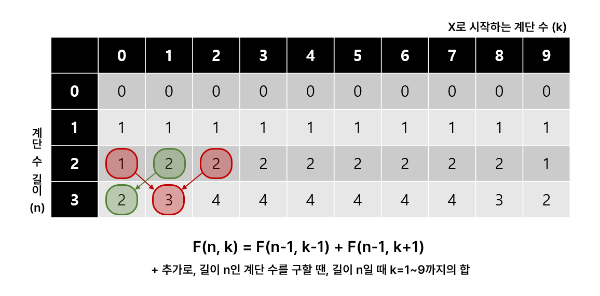
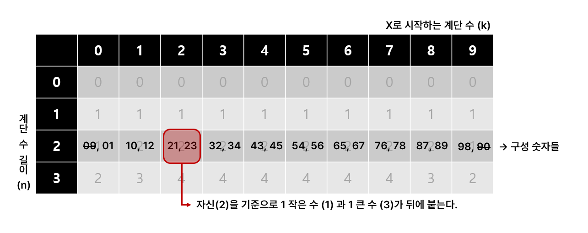
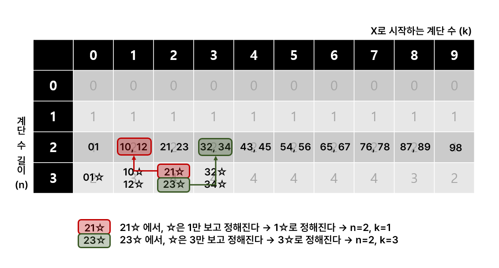

# [BOJ 10844] 쉬운 계단 수

https://www.acmicpc.net/problem/10844

<br/>

## 0. 문제

45656이란 수를 보자. 이 수는 인접한 모든 자리의 차이가 1이다. 이런 수를 계단 수라고 한다.

N이 주어질 때, 길이가 N인 계단 수가 총 몇 개 있는지 구해보자. 단, 0으로 시작하는 수는 계단수가 아니다.

첫째 줄에 정답을 1,000,000,000으로 나눈 나머지를 출력한다.

<br/>

## 1. 아이디어



먼저 결론부터 말하자면, 위와 결론이 나온다. `F(n, k) = F(n-1, k-1) + F(n-1, k+1)` 이라는 점화식으로 2차원 배열을 채운 후, 길이 n인 계단 수를 구할 때는 길이 n일 때 k=1~9까지의 합을 구하면 된다.



그러면 점화식 결론이 어떻게 나왔는지 생각해보자. 규칙성을 찾기 위해 n이 2, 3일 때 정도는 직접 작성해보는 것이 좋다. n이 2일 때 각 자리의 구성 요소들은 위 표와 같다. **자신을 기준으로 1작은 수와 1큰 수를 붙여서 계단 수를 만들 수 있는 것을 알 수 있다.**

이 때, 표의 맨 앞인 0은 1작은 수 (09)와 1큰 수 (01) 로 구성되는데, 09는 계단 수가 아니므로 제외한다. 같은 방식으로 표의 맨 끝인 9역시 90이 계단 수가 아니므로 제외한다.



n=3일 때도 작성해보자. 많이 작성할 필요도 없다. k=2일 때(2로 시작하는 계단 수) 를 작성하려고 보면, 100의 자리수가 2이니, 10의 자리수는 1혹은 3일 것이다. 21☆과 23☆. 그럼 ☆은 어떻게 정해지는가? ☆을 정하기 위해서는 10의 자리수만 보면 된다. 그 값은 n=2일 때 k=1, 3 값이다.

마지막으로 답을 낼 때는 1~9로 시작하는 계단 수를 모두 더해서 내면 된다. 0으로 시작하는 값은 계단 수가 아니다.

<br/>

## 2. 전체 코드

```python
N = int(input())
DP = [[0] * 10 for _ in range(N+1)]

# x축: 0__, 1__, 2__ ... => x로 시작하는 계단 수
# y축: 숫자 길이
for i in range(10):
    DP[1][i] = 1

for r in range(2, N+1):
    for c in range(10):
        tmp1 = (c-1 >= 0) and DP[r-1][c-1]
        tmp2 = (c+1 < 10) and DP[r-1][c+1]
        # 11시, 1시 방향에 위치한 두 값을 더해준다.
        DP[r][c] = (tmp1 + tmp2) % 1000000000

# DP[N][0]은 0으로 시작하는 계단 수는 불가능하므로 빼준다
# 합했을 때 % 연산을 안 해서 틀렸었다.
print(sum(DP[N][1:]) % 1000000000)
```

<br/>

## 3. 다른 사람 코드

```python
N = int(input())

DP = [[0]*10 for i in range(101)]
DP[1] = [0, 1, 1, 1, 1, 1, 1, 1, 1, 1]

for i in range(2, N+1):
    for j in range(10):
        if j == 0:
            DP[i][j] = DP[i-1][j+1]
        elif j == 9:
            DP[i][j] = DP[i-1][j-1]
        else:
            DP[i][j] = DP[i-1][j+1] + DP[i-1][j-1]
            
result = 0
for i in range(0, 10):
    result += DP[N][i]

print(result % 1000000000)
```

나는 x축의 값을 가장 큰 자리 수 값으로 잡았는데, 이 사람의 경우 가장 작은 자리 수 값으로 잡았다. 

나는 가장 큰 자리수 값이 0일 때 계단수가 아니기 때문에 result에서 인덱스 0의 값은 제외해줬는데, 이 사람의 경우 가장 작은 자리수 값이 0일 때도 계단수가 될 수 있기 때문에 인덱스 0의 값도 포함시켜준다.
