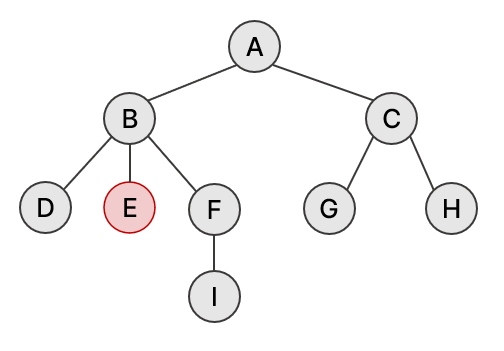
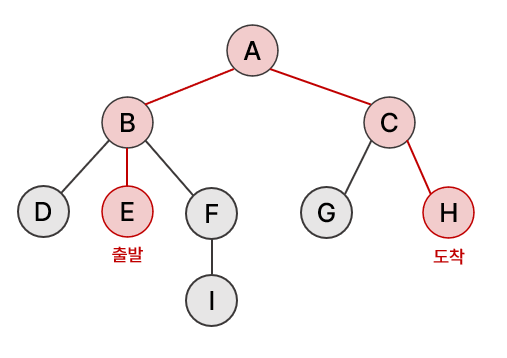
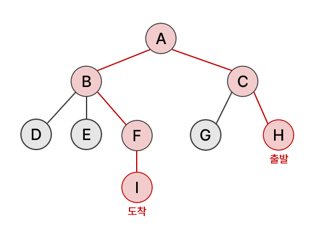

# [BOJ 1167] 트리의 지름

https://www.acmicpc.net/problem/1167


## 0. 문제

트리의 지름이란, 트리에서 임의의 두 점 사이의 거리 중 가장 긴 것을 말한다. 트리의 지름을 구하는 프로그램을 작성하시오.


## 1. 아이디어

1. 트리의 지름은 다음과 같이 구할 수 있다.

   > 임의의 노드 A에서 가장 먼 노드 B를 구한다. 노드 B에서 다시 한 번 가장 먼 노드 C를 구하면 그 사이의 거리가 지름이다.

2. 위 공식이 어떻게 가능한 지 생각해보자.

   - 노드 E를 기준으로 생각해보자. 트리의 지름은 **E를 포함하는 경우, 포함하지 않는 경우**가 있을 것이다.

   

   - 트리의 지름이 E를 포함하는 경우는 그림과 같다.

     - 이는 위 공식에서 **첫 번째로 임의의 노드 E에서 시작해 가장 먼 노드H를 찾는 경우**에 해당한다.
     - 만약 E에 자식 노드가 있었다면? 그 경우는 **두 번째로 가장 먼 노드H 에서 다시 한 번 가장 먼 노드를 찾을 때** 고려된다.

     

   - 트리의 지름이 E를 포함하지 않는다면 그림과 같다.

     - 이 때는 첫 번째로 가장 먼 노드 H를 찾고, **두 번째로 가장 먼 노드 H에서 다시 한 번 가장 먼 노드를 찾을 때** 고려된다.

     

   - 따라서 위 공식으로 트리의 지름을 구할 수 있다.

   


## 2. 구현

```python
import sys
input = sys.stdin.readline


def bfs(n):
    visited = [0] * (V+1)
    q = [n]
    visited[n] = 1
    while q:
        v = q.pop(0)
        for w, dist in tree[v]:
            if not visited[w]:
                q.append(w)
                visited[w] = visited[v] + dist

    # 출력할 때 dist 시작 값이 1이라 dist 값은 1 빼줘야 함
    max_dist = max(visited)
    max_node = visited.index(max_dist)

    return max_node, max_dist


V = int(input())
tree = [[] for _ in range(V+1)]
for _ in range(V):
    IN = list(map(int, input().split()))
    n1 = IN[0]
    i = 1
    while IN[i] != -1:
        n2, dist = IN[i], IN[i+1]
        tree[n1].append((n2, dist))
        i += 2

# 임의의 노드에서 가장 먼 노드를 구한다
# 가장 먼 노드에서 가장 먼 노드를 구하면 트리의 지름
max_node, max_dist = bfs(1)
max_node, max_dist = bfs(max_node)
print(max_dist - 1)
```


