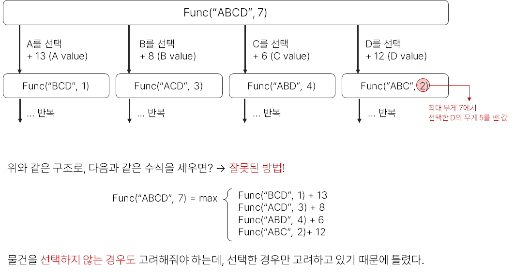
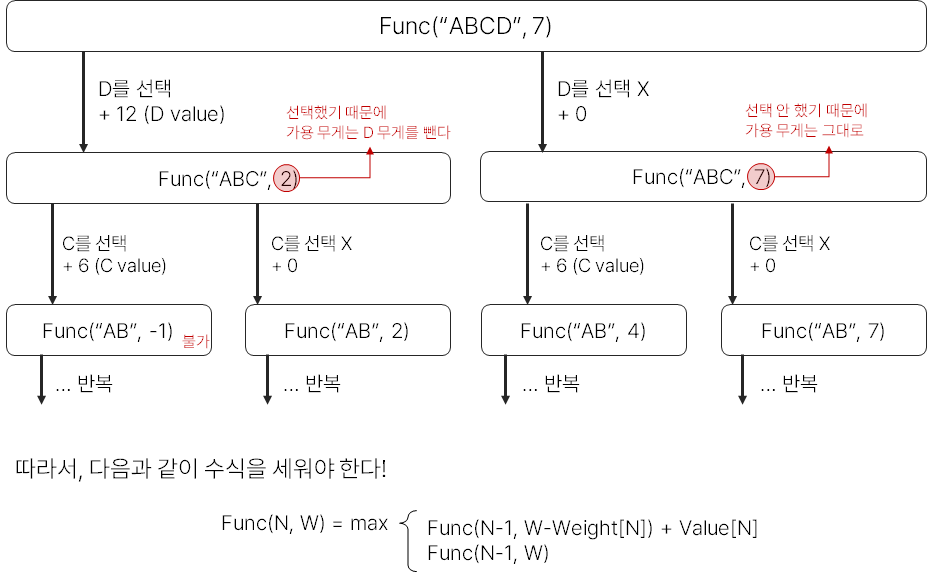
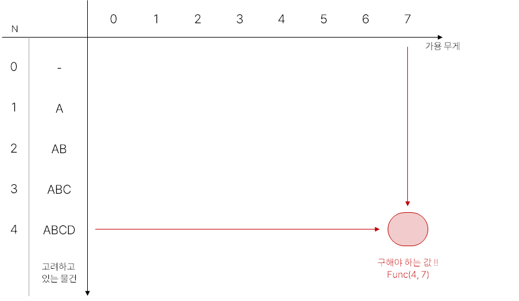
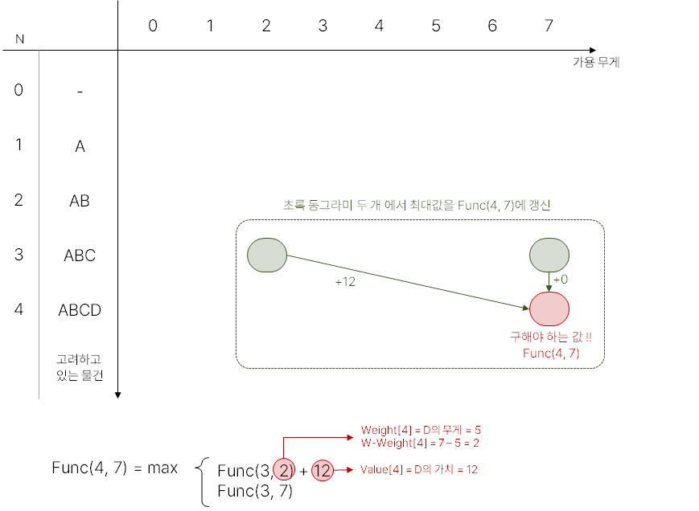
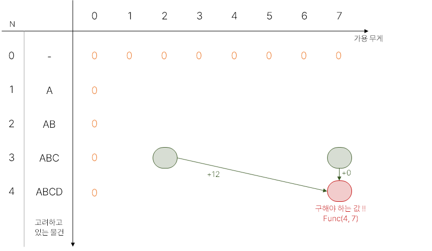
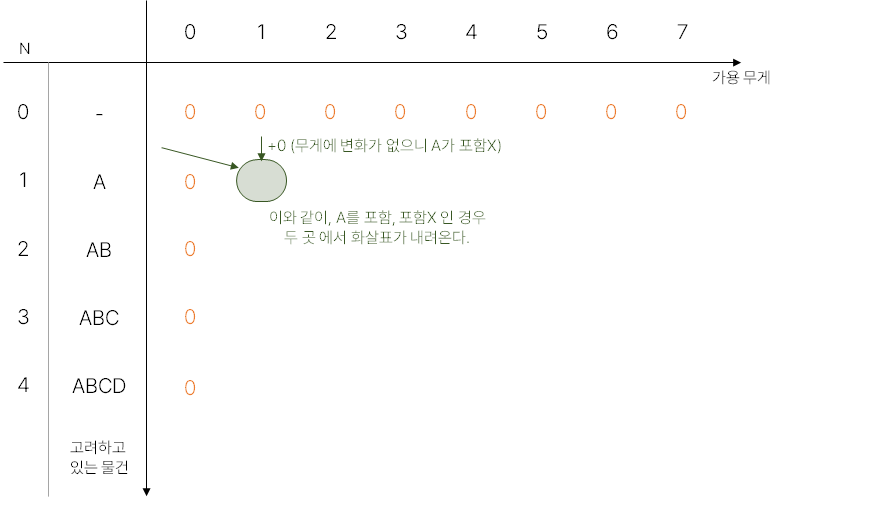
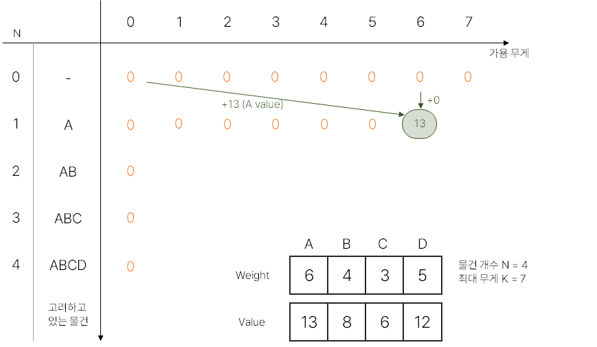

# [BOJ 12865] 평범한 배낭

https://www.acmicpc.net/problem/12865


## 0. 문제

- N개의 물건이 있다. 각 물건은 무게 W와 가치 V를 가진다.
- 최대 K만큼의 무게를 배낭에 넣을 수 있다. 넣을 수 있는 물건들의 가치 최대값은 얼마인가?

[BOJ 12865] 평범한 배낭은 0-1 기본적인 배낭 문제이다.


배낭 문제는 담을 수 있는 **무게의 최댓값이 정해져 있고 일정 가치와 무게가 있는 짐들을 배낭에 넣을 때, 가치의 합이 최대가 되도록 짐을 고르는 방법**을 찾는 문제를 말한다.

배낭문제는 짐을 쪼갤 수 있는 경우(무게가 소수일 수 있는 경우)와 짐을 쪼갤 수 없는 경우(이 경우 짐의 무게는 0 이상의 정수만 가능) 두 가지로 나눌 수 있는데, 짐을 쪼갤 수 있는 경우의 배낭문제를 **분할가능 배낭문제**(Fractional Knapsack Problem), 짐을 쪼갤 수 없는 경우의 배낭문제를 **0-1 배낭문제**(0-1 Knapsack Problem)라 부른다.

<br/>

## 1. 풀이

동적 계획법 (DP) 는 복잡한 문제를 간단한 여러 개의 문제로 나누어 푸는 방법이다. 이 문제 역시 간단한 작은 문제로 나누어 풀 수 있다. 하지만 아래와 같이 실수를 할 수 있으니 조심할 것. 해당 내용은 [이 곳 / 코딩테스트, 중급, knapsack problem](https://www.youtube.com/watch?v=rhda6lR5kyQ&ab_channel=%EC%BD%94%EB%93%9C%EC%97%86%EB%8A%94%ED%94%84%EB%A1%9C%EA%B7%B8%EB%9E%98%EB%B0%8D) 내용을 정리한 것이다.


### a. 잘못된 방법




### b. 올바른 방법




### b-1. bottom-up 방식

수식을 세우고 문제로 돌아오면 우리가 구해야 하는 값이 Func(4, 7)이라는 것을 알 수 있다. 2차원 배열을 만들어 위치를 찾으면 다음 그림과 같다.



빨간 동그라미인  Func(4, 7)은 Func(3, 2) + 12와 Func(3, 7) 중 큰 값을 선택하면 된다. 또, 초록 동그라미 Func(3, 2)와 Func(3, 7)을 구하기 위해서는 수식을 반복하면 된다.





수식을 반복하다보면 표의 첫 행, 첫 열로 돌아온다. 해당 부분들은 가용 무게가 0이거나, 고려하고 있는 물건이 없으므로 값이 모두 0이게 된다.




### b-2. top-down 방식

이 경우, 가용 무게가 넉넉하여 물건을 선택할 수 있을 경우 왼쪽에서 화살표가 오고, 물건을 선택할 수 없을 경우 바로 위에서 화살표가 온다. 두 화살표의 최대값으로 갱신하면 된다.



실제 문제에선, A를 처음 선택할 수 있는 경우가 무게 6일 때 이므로 초록 부분에 13이 처음 갱신된다.




## 2. 코드

```python
# b-2. top-down 방식
N, K = map(int, input().split())

# (1, 1) 부터 시작하기 위해 [0, 0] 삽입
IN = [[0, 0]]
for _ in range(N):
    IN.append(list(map(int, input().split())))

dp = [[0 for _ in range(K + 1)] for _ in range(N + 1)]
for i in range(1, N + 1):
    for j in range(1, K + 1):
        weight = IN[i][0]
        value = IN[i][1]

        # weight(선택한 물건의 무게) 보다 j(가용 무게)가 작으면 위의 값을 그대로 가져온다
        if j < weight:
            dp[i][j] = dp[i - 1][j]

        # weight 보다 j가 크면 화살표는 왼쪽에서도 올 수 있으니, 큰 값으로 갱신한다.
        # 왼쪽 화살표 => 이전 행 & 가용무게 - 선택 물건 무게 & 가치 더하기 => dp[i-1][j-weight] + value
        else:
            dp[i][j] = max(dp[i - 1][j - weight] + value, dp[i - 1][j])

print(dp[N][K])
```


## 3. 다른 사람 코드

```python
N, K = map(int, input().split())
ary = [list(map(int, input().split())) for _ in range(N)]

dp = [0] * (K+1)
for weight, val in ary:
    for j in range(K, weight-1, -1):
        dp[j] = max(dp[j], dp[j-weight] + val)

print(dp[K])
```
