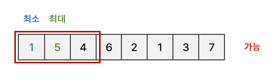
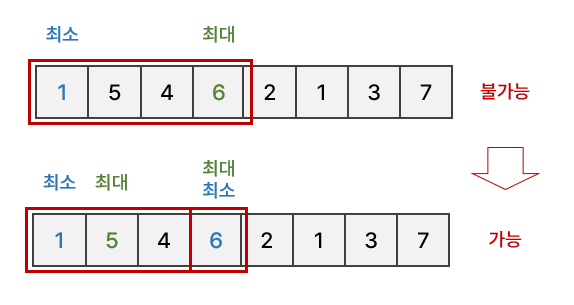

# [BOJ 13397] 구간 나누기 2

https://www.acmicpc.net/problem/13397

<br/>

## 0. 문제

- 배열과 배열의 크기 N, 배열을 나눌 수 있는 구간의 수 M이 주어진다.
- 배열을 M개 이하의 구간으로 나누었을 때, 각 구간의 최댓값 - 최솟값을 **구간의 점수**로 한다.
- 구간의 점수들 중에 **최댓값이 최소가 되도록** 구간을 분할했을 때, 그 최댓값은 얼마인가?


예를 들어, [1, 5, 4, 6, 2, 1, 3, 7] 이고, M = 3이면 다음과 같다.

- [1, 5], [4, 6, 2], [1, 3, 7]로 구간을 나누면 각 구간의 점수는 4, 4, 6점이 되고, 최댓값은 6점이다.
- [1, 5, 4], [6, 2, 1], [3, 7]로 구간을 나누었다면, 각 구간의 점수는 4, 5, 4점이 되고, 최댓값은 5점이다.

두 경우 중에서 최댓값이 최소인 것은 5점인 것이고, 5점보다 최댓값을 작게 만드는 방법은 없다.


<br/>

## 1. 아이디어

이분탐색을 활용한다.

- 이분탐색의 mid값을 구간의 점수의 최댓값으로 설정한다.
- 해당 최댓값이 나오도록 하기 위해, M개의 구간으로 나누는 것이 충분한지 확인한다.


이분탐색으로 **구간의 점수의 최댓값을 `4`로 설정**했다고 가정하자.

앞에서부터 배열을 탐색하며 최솟값, 최댓값을 기록해두고, 해당 값이 구간의 점수 최댓값 이하인지 확인한다. 아래 예시에서, 최소 1, 최대 5 이므로 구간의 점수는 4이고, 우리가 설정한 최댓값 이하이므로 가능하다.



구간을 확장하며 새로운 구간의 점수를 하다가, **우리가 설정한 구간의 점수의 최댓값을 넘어서게 되면 구간을 나눈다.** 아래 예시에서, 최소 1, 최대 6 이므로 구간의 점수는 5이고, 우리가 설정한 최댓값 이상이다. 따라서 해당 지점에서 구간을 새롭게 만들고 구간의 수를 +1 해준다.



최종적으로 구간의 수가 M개 이하이면 우리가 설정한 구간의 점수 최댓값이 타당한 값이라는 뜻이다.


<br/>

## 2. 전체 코드

```python
import sys
input = sys.stdin.readline
# sys.stdin = open("input.txt", "r")

# 해당 value를 기준으로 구간을 나눌 수 있는지
def isValid(value):
    # low, high값, 구간의 수 초기화
    low = high = IN[0]
    cnt = 1

    # 배열을 탐색하면서 최대값이 나오면 high 갱신, 최소값이 나오면 low 갱신
    for i in IN:
        high = max(high, i)
        low = min(low, i)

        # 최대 - 최소 (구간의 점수) 가 value보다 크면 새로운 구간으로 설정
        if high - low > value:
            cnt += 1
            low = high = i

    # 만들 수 있는 구간의 개수보다 cnt가 적으면 가능
    return M >= cnt
    
N, M = map(int, input().split())
IN = list(map(int, input().split()))

end = max(IN)
start = 0

# 이분 탐색
result = end
while start <= end:
    mid = (start + end) // 2

    if isValid(mid):
        end = mid - 1
        result = min(result, mid)
    else:
        start = mid + 1

print(result)
```

