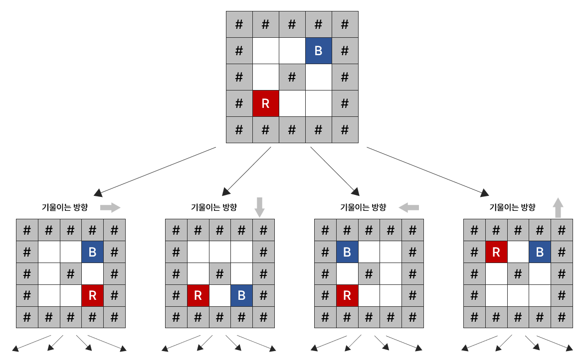
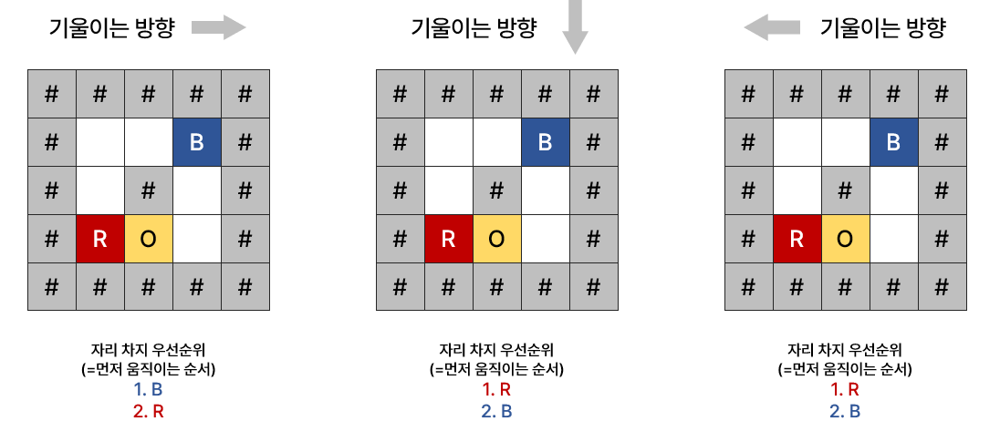

# [BOJ 13459] 구슬 탈출

https://www.acmicpc.net/problem/13459

<br/>

## 0. 문제

보드의 세로 크기는 N, 가로 크기는 M이고, 편의상 1×1크기의 칸으로 나누어져 있다. 가장 바깥 행과 열은 모두 막혀져 있고, 보드에는 구멍이 하나 있으며 빨간 구슬, 파란 구슬이 하나씩 들어가 있다. 게임의 목표는 빨간 구슬을 구멍을 통해서 빼내는 것이다. 이때, 파란 구슬이 구멍에 들어가면 안 된다.

이때, 구슬을 손으로 건드릴 수는 없고, 중력을 이용해서 이리 저리 굴려야 한다. 왼쪽으로 기울이기, 오른쪽으로 기울이기, 위쪽으로 기울이기, 아래쪽으로 기울이기와 같은 네 가지 동작이 가능하다. 기울이는 동작을 그만하는 것은 더 이상 구슬이 움직이지 않을 때 까지이다.

보드의 상태가 주어졌을 때, 10번 이하로 빨간 구슬을 구멍을 통해 빼낼 수 있는지 구하는 프로그램을 작성하시오.

<br/>

## 1. 아이디어

1. 가지치기나 DP같은 것을 쓸 수 없어서 완전 탐색을 생각했다.

   - 보드에다가 한 방향으로 기울이기를 10번씩 해야하니 재귀
   - 함수는 `메인 재귀 함수`, `구슬 움직이기`, `어떤 구슬이 먼저 움직이는지 `

2. 메인 재귀 함수

   - 재귀 함수라 백트래킹 형식처럼 종료 조건, 가지치기(없음), 재귀 영역으로 구성
   - 종료할 때는 11번 이상 움직여야할 때, 파란 구슬이 탈출했을 때, 성공적으로 빨간 구슬이 탈출했을 때
   - 현재 상태에서 4방향으로 기울이는 다음 상태로 갈 때 재귀를 이용한다

   

3. 어떤 구슬이 먼저 움직이는지

   - 방향에 따라 어떤 구슬이 먼저 움직이는지 하드코딩

   

4. 구슬 움직이기

   - while문을 이용하여 다음 위치로 이동할 수 있으면 현재 위치 값을 다음 위치 값으로 변경한다.
   - 다음 위치가 탈출구면 파란 구슬이 탈출하면 실패, 빨간 구슬만 탈출하면 성공
   - 다음 위치가 벽이거나 상대 색깔 구슬을 만나면 현재 위치 값을 변경하지 않고 종료한다.

   

<br/>

## 2. 전체 코드

```python
# 위, 아래, 왼쪽, 오른쪽
dr = [-1, 1, 0, 0]
dc = [0, 0, -1, 1]


# 구슬 움직이기
def move(color, pos, d, board):
    r, c = pos
    board[r][c] = "."
    while 1:
        next_position = board[r + dr[d]][c + dc[d]]
        # 다음 위치로 이동할 수 있으면 이동
        if next_position == ".":
            r += dr[d]
            c += dc[d]
        # 다음 위치가 탈출구면 탈출
        elif next_position == "O":
            return (-1, -1), board
        # 벽이거나 다른 색 구슬 만나면 정지
        else:
            board[r][c] = color
            return (r, c), board


# 먼저 움직이는 구슬 색깔 판별
def first_second_move(d, red_pos, blue_pos):
    # 위 - 아래 - 왼쪽 - 오른쪽
    first, second = "R", "B"
    if d == 0:
        if red_pos[0] > blue_pos[0]:
            first, second = "B", "R"
    elif d == 1:
        if red_pos[0] < blue_pos[0]:
            first, second = "B", "R"
    elif d == 2:
        if red_pos[1] > blue_pos[1]:
            first, second = "B", "R"
    else:
        if red_pos[1] < blue_pos[1]:
            first, second = "B", "R"
    return first, second


def func(turn: int, board: list, d: int, red_pos, blue_pos) -> int:
    # 종료 조건
    if turn == 11 or blue_pos == (-1, -1):
        return 0
    if red_pos == (-1, -1):
        return 1

    # 먼저 움직이는 구슬 알아내기
    first, second = first_second_move(d, red_pos, blue_pos)
    # red가 먼저 움직임
    if first == "R":
        red_pos, board = move("R", red_pos, d, board)
        blue_pos, board = move("B", blue_pos, d, board)
    # blue가 먼저 움직임
    else:
        blue_pos, board = move("B", blue_pos, d, board)
        red_pos, board = move("R", red_pos, d, board)

    # 상하좌우 방향으로 움직이기 재귀
    for i in range(4):
        # 같은 방향 연속은 안봐도 됨
        if i == d:
            continue
        # 새로 board 만들어서 넘겨서 재귀
        copy_board = [i[:] for i in board]
        ret = func(turn + 1, copy_board, i, red_pos, blue_pos)
        # red 구슬이 탈출해서 끝나면 종료
        if ret:
            return 1
    return 0


N, M = map(int, input().split())
board = [list(input()) for _ in range(N)]

for r in range(N):
    for c in range(M):
        if board[r][c] == "R":
            red_pos = (r, c)
        elif board[r][c] == "B":
            blue_pos = (r, c)

# flag는 구슬 탈출했는지
flag = 0
for d in range(4):
    copy_board = [i[:] for i in board]
    flag = func(0, copy_board, d, red_pos, blue_pos)
    if flag:
        break
print(flag)
```

- 매 루프마다 board를 복사해서 빨간 구슬, 파란 구슬의 위치를 board에 써주었는데, 그래서 시간이 굉장히 오래걸린다. 구슬의 위치를 tuple에 저장만 해서 비교하면 더 빠르게 할 수 있을 듯
