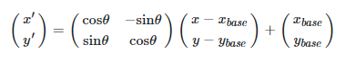

# BOJ 15685 드래곤 커브

https://www.acmicpc.net/problem/15685

### 0. 문제

K(K > 1)세대 드래곤 커브는 K-1세대 드래곤 커브를 끝 점을 기준으로 90도 시계 방향 회전 시킨 다음, 그것을 끝 점에 붙인 것이다. 크기가 100×100인 격자 위에 **드래곤 커브가 N개** 있다. 이때, 크**기가 1×1인 정사각형의 네 꼭짓점이 모두 드래곤 커브의 일부인 정사각형의 개수**를 구하는 프로그램을 작성하시오


### 1. 아이디어

- 1번째 아이디어

  1. 90도 시계 방향으로 회전 => 회전 변환을 해볼까? 
  2. 격자 좌표를 초기값으로 생성해둔다.
  3. 0세대 드래곤 커브를 그린 후, 해당 모양 만큼 격자 좌표를 회전시킨다.
  4. 원본 격자와 회전시킨 격자를 끝점을 맞춰 더해서 1세대 드래곤 커브를 그린다.
  5. 문제 => 회전은 끝 방향을 기준으로 시켜야하는데 4꼭지점 중 어떤 것을 기준으로 회전시킬 것 인가?

  ```python
  # 회전 변환
  arr = [[1, 2, 3], [4, 5, 6], [7, 8, 9], [10, 11, 12]]
  
  # 전치행렬
  arr_trans = [list(i) for i in zip(*arr)]
  
  # 시계 방향으로 90도 회전
  arr_cw90_tuple = list(zip(*arr[::-1]))
  # arr_cw90_list1 = list(map(list, zip(*arr[::-1])))
  arr_cw90_list2 = [list(i) for i in zip(*arr[::-1])]
  
  # 반시계 방향으로 90도 회전
  arr_ccw90_tuple = list(zip(*arr))[::-1]
  # arr_ccw90_list1 = list(map(list, list(zip(*arr))[::-1]))
  arr_ccw90_list2 = [list(i) for i in list(zip(*arr))[::-1]]
  ```

- 2번째 아이디어

  

  1. 0세대부터 그려진 드래곤 커브를 끝점에서부터 역방향으로 따라가며 90도 회전시키면 다음 세대가 된다.
  2. 현재 드래곤 커브와 다음 드래곤 커브의 각 대응하는 점은 항상 평행이동에 90도 회전된 관계다. (당연)
  3. 자세히 보니 끝점을 기준으로 회전변환한 좌표와 동일하다.
  4. 끝점부터 역순으로 따라가며 회전변환한 좌표를 등록하자.
  5. 등록한 좌표를 현재 드래곤 커브와 붙이면 다음 드래곤 커브가 된다.
     - 원점을 기준으로하는 회전 변환 행렬
     
     
     
     - 끝점은 원점이 아니므로 평행이동 시켜주면 된다. 이해가 안 되면 [여길](https://gaussian37.github.io/math-la-rotation_matrix/) 참고
     
     

<br/>

### 2. 구현

```python
dy = [0, -1, 0, 1]
dx = [1, 0, -1, 0]

N = int(input())
matrix = [[0]*101 for _ in range(101)]

for _ in range(N):
    x, y, d, g = map(int, input().split())
    # 초기 0세대 드래곤 커브
    curve = 0
    current = [(x, y), (x + dx[d], y + dy[d])]

    while curve != g:
        next = []
        # 가장 마지막에 추가된 지점이 회전 중심 = 끝점
        x0, y0 = current[-1]

        # 지금까지 쌓아온 것을 뒤로 돌아가며 회전시킨다
        # 수식에서 x'=> nx, x => x, xbase => n0 이다
        for x, y in current[:-1][::-1]:
            nx = x0 + y0 - y
            ny = -x0 + y0 + x
            next.append((nx, ny))

        # 커브 +1 하고 current에 회전시킨 것들 붙여줌
        curve += 1
        current += next

    # 드래곤 커브들의 위치 1로 다 바꿔줌
    for x, y in current:
        matrix[y][x] = 1

# 4 꼭짓점 모두 1이면 result +1
result = 0
for y in range(100):
    for x in range(100):
        if matrix[x][y] and matrix[x+1][y] and matrix[x][y+1] and matrix[x+1][y+1]:
            result += 1

print(result)
```

<br/>

### 3. 다른 사람의 코드

```python
a = [[0]*101 for _ in range(101)]
dr = [[0]]

# 10세대까지, 각 세대에서 점들의 회전 순서를 미리 작성
for _ in range(10):
    dr.append(dr[-1] + [i+1 for i in dr[-1][::-1]])

dx = [1, 0, -1, 0]
dy = [0, -1, 0, 1]

for _ in range(int(input())):
    x, y, d, g = map(int, input().split())
    # 0 세대 드래곤커브
    a[x][y] = 1
    # g세대에 도착할 때까지 회전시켜가며 체크
    for k in dr[g]:
        x += dx[(d + k) % 4]
        y += dy[(d + k) % 4]
        a[x][y] = 1

cnt = 0
for i in range(100):
    for j in range(100):
        if a[i][j] and a[i][j+1] and a[i+1][j] and a[i+1][j+1]:
            cnt += 1

print(cnt)
```


