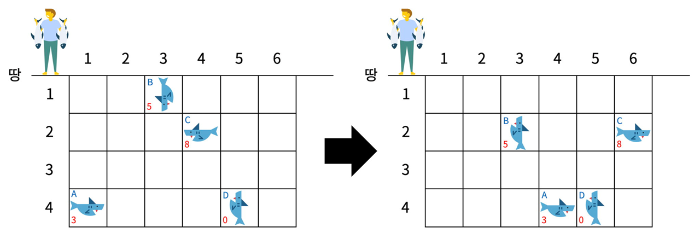

# [BOJ 17143] 낚시왕

 ## 0. 문제



낚시왕은 처음에 1번 열의 한 칸 왼쪽에 있다. 다음은 1초 동안 일어나는 일이며, 아래 적힌 순서대로 일어난다. **낚시왕은 가장 오른쪽 열의 오른쪽 칸에 이동하면 이동을 멈춘다.** 상어는 입력으로 주어진 속도로 이동하고, 속도의 단위는 칸/초이다. **상어가 이동하려고 하는 칸이 격자판의 경계를 넘는 경우에는 방향을 반대로** 바꿔서 속력을 유지한채로 이동한다.

1. 낚시왕이 오른쪽으로 한 칸 이동한다.
2. 낚시왕이 있는 열에 있는 상어 중에서 땅과 제일 가까운 상어를 잡는다. 상어를 잡으면 격자판에서 잡은 상어가 사라진다.
3. 상어가 이동한다.

<br/>

## 1. 아이디어

1. 상어가 이동하는 것이 관건
   - 한 칸씩 이동한다 => 시간이 너무 오래 걸릴 듯 => 이거 해보니까 통과되긴 함
   - 마지막 좌표를 계산한다 => 마지막 좌표 계산이 어려워서 상어의 왕복 한 사이클씩 줄인다.
2. 구현
   - 상어의 전체 이동 거리 : dist = |속력 x 방향|
   - 한 바퀴 돌고 제자리로 오면 위치, 방향이 동일하다. 한 바퀴 거리는 2 x 전체 높이 or 너비 - 2
     - 아래 그림처럼 너비가 6인 맵에서 상어가 제 자리로 돌아오려면 2 x 6 - 2 = 10 만큼 움직여야 한다.
     - 처음 상태 = 10만큼 움직인 후 와 같다.
   - n 바퀴 돌고온 후 (=처음 상태)에서 남은 거리만큼만 추가적으로 이동하면 된다 (% 연산 적용)


<br/>

## 2. 코드

```python
import sys
sys.stdin = open("input.txt", "r")
from itertools import product

# 위, 오른쪽, 아래, 왼쪽
dr = [-1, 0, 1, 0]
dc = [0, 1, 0, -1]


def shark_move(matrix):
    # 상어 이동한 후 내용은 next_matrix에 작성한다
    next_matrix = [[0] * (C+1) for _ in range(R+1)]

    # 원래 matrix에서 상어 이동시키기
    for r, c in product(range(1, R+1), range(1, C+1)):
        # 상어가 없으면 패스
        if not matrix[r][c]:
            continue

        # 상어가 있으면 : s, d, z = 속력, 방향, 크기
        s, d, z = matrix[r][c]

        # 전체 이동해야하는 거리
        dist = abs((dr[d] + dc[d]) * s)
        # 이동해야하는 거리로부터, n 사이클 돌고 난 후 남은 거리 계산
        dist2 = dist % (2*R - 2) if dr[d] else dist % (2*C - 2)

        while dist2:
            nr = r + dr[d]
            nc = c + dc[d]
            if 1 <= nr < R+1 and 1 <= nc < C+1:
                r, c = nr, nc
                dist2 -= 1
            else:
                d = (d + 2) % 4

        # 이동 후 내용을 next_matrix에 작성한다.
        if next_matrix[r][c]:
            if next_matrix[r][c][2] < z:
                next_matrix[r][c] = [s, d, z]
        else:
            next_matrix[r][c] = [s, d, z]

    return next_matrix


R, C, M = map(int, input().split())
matrix = [[0]*(C+1) for _ in range(R+1)]

# 상어 정보 인풋
for _ in range(M):
    r, c, s, d, z = map(int, input().split())
    if d == 2:
        d = 3
    elif d == 3:
        d = 2
    matrix[r][c] = [s, d-1, z]

# 1. 낚시왕은 오른쪽으로 한 칸씩 이동한다.
result = 0
for c in range(1, C+1):
    # 2. 해당 열에서 땅과 제일 가까운 상어를 잡는다.
    for r in range(1, R+1):
        if matrix[r][c]:
            result += matrix[r][c][2]
            matrix[r][c] = 0
            break
    # 3. 상어가 이동한다.
    matrix = shark_move(matrix)

print(result)
```

<br/>

## 3. 다른 사람 코드

```python
import sys
sys.stdin = open("input.txt", "r")

def solve(sea):
    new_sea = [[0] * (C + 1) for _ in range(R + 1)]
    for r in range(1, R + 1):
        for c in range(1, C + 1):
            # 상어가 없으면 패스
            if not sea[r][c]:
                continue

            # 상어가 있으면 진행
            s, d, z = sea[r][c]
            nr, nc = r + s * dir[d][0], c + s * dir[d][1]

            # 범위 바깥이면
            while nr < 1 or nr > R:
                # nr이 1 보다 작으면 방향은 아래
                if nr < 1:
                    d = 2
                    nr = 2 - nr
                # nr이 R보다 크면 방향은 위
                elif nr > R:
                    d = 1
                    nr = R + R - nr

            # 범위 바깥이면
            while nc < 1 or nc > C:
                # nc가 1보다 작으면 방향은 오른쪽
                if nc < 1:
                    d = 3
                    nc = 2 - nc
                # nc가 C보다 크면 방향은 왼쪽
                elif nc > C:
                    d = 4
                    nc = C + C - nc

            # 새로운 값으로 갱신
            if new_sea[nr][nc] != 0:
                if z > new_sea[nr][nc][2]:
                    new_sea[nr][nc] = [s, d, z]
            else:
                new_sea[nr][nc] = [s, d, z]
    return new_sea


R, C, m = map(int, input().split())
sea = [[0] * (C + 1) for i in range(R + 1)]
dir = [[0, 0], [-1, 0], [1, 0], [0, 1], [0, -1]]

for k in range(m):
    i, j, s, d, z = map(int, input().split())
    # 한 왕복거리 내로 s 값 조절
    s %= ((R if d <= 2 else C) - 1) * 2
    sea[i][j] = [s, d, z]

cur = 0
result = 0
while cur < C:
    cur += 1
    # 2. 해당 열에서 땅과 제일 가까운 상어를 잡는다.
    for k in range(1, R + 1):
        if sea[k][cur] != 0:
            result += sea[k][cur][2]
            sea[k][cur] = 0
            break
    # 3. 상어가 이동한다.
    sea = solve(sea)

print(result)
```

