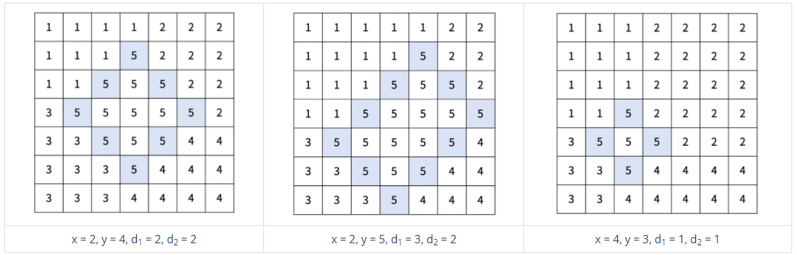
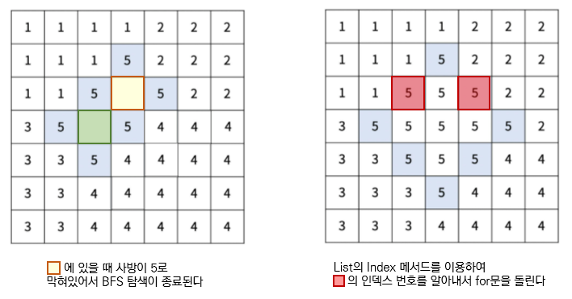

# [BOJ 17779] 게리맨더링2

https://www.acmicpc.net/problem/17779


## 0. 문제

선거구를 다음과 같은 기준으로 나눈다. 

1. 기준점 (x, y)와 경계의 길이 d1, d2를 정한다. (d1, d2 ≥ 1, 1 ≤ x < x+d1+d2 ≤ N, 1 ≤ y-d1 < y < y+d2 ≤ N)
2. 다음 칸은 경계선이다.
   1. (x, y), (x+1, y-1), ..., (x+d1, y-d1)
   2. (x, y), (x+1, y+1), ..., (x+d2, y+d2)
   3. (x+d1, y-d1), (x+d1+1, y-d1+1), ... (x+d1+d2, y-d1+d2)
   4. (x+d2, y+d2), (x+d2+1, y+d2-1), ..., (x+d2+d1, y+d2-d1)
3. 경계선과 경계선의 안에 포함되어있는 곳은 5번 선거구이다.
4. 5번 선거구에 포함되지 않은 구역 (r, c)의 선거구 번호는 다음 기준을 따른다.
   - 1번 선거구: 1 ≤ r < x+d1, 1 ≤ c ≤ y
   - 2번 선거구: 1 ≤ r ≤ x+d2, y < c ≤ N
   - 3번 선거구: x+d1 ≤ r ≤ N, 1 ≤ c < y-d1+d2
   - 4번 선거구: x+d2 < r ≤ N, y-d1+d2 ≤ c ≤ N



선거구를 나누는 방법 중에서, 인구가 가장 많은 선거구와 가장 적은 선거구의 인구 차이의 최솟값은?


## 1. 아이디어

1. 문제에 수식이 많아서 그림만 보고 풀려고 했는데 그건 무리였다.
2. 문제 천천히 읽고 수식 범위 맞춰서 for문 돌리기
   - 5선거구 경계선부터 체크하고, 경계선 안에 포함된 곳을 체크하기
   - 나머지 체크되지 않은 부분을 확인하며 1~4 선거구 체크하기
3. 5 선거구 경계선 안에 포함된 곳을 체크할 때 bfs를 하려고 했는데 안 돼서 for문을 사용했다.
   - BFS 사용해서 5는 벽, 비어 있는 곳은 이동할 수 있다고 생각할 때, 노란색에서 시작하면 초록색으로 못 넘어간다.
   - 그래서 인덱스 번호를 알아내 for문을 돌려가며 경계선 안을 체크한다




## 2. 코드

```python
def divide(d1, d2, x, y):
    section = [[0] * (N + 2) for _ in range(N + 2)]

    # 다른 선거구 세기
    # 1번 선거구: 1 ≤ r < x+d1, 1 ≤ c ≤ y
    for r in range(1, x + d1):
        for c in range(1, y + 1):
            section[r][c] = 1

    # 2번 선거구: 1 ≤ r ≤ x+d2, y < c ≤ N
    for r in range(1, x + d2 + 1):
        for c in range(y + 1, N + 1):
            section[r][c] = 2

    # 3번 선거구: x+d1 ≤ r ≤ N, 1 ≤ c < y-d1+d2
    for r in range(x + d1, N + 1):
        for c in range(1, y - d1 + d2):
            section[r][c] = 3

    # 4번 선거구: x+d2 < r ≤ N, y-d1+d2 ≤ c ≤ N
    for r in range(x + d2 + 1, N + 1):
        for c in range(y - d1 + d2, N + 1):
            section[r][c] = 4

    # 5번 선거구 경계 만들기
    # 경계 1: (x, y), (x+1, y-1), ..., (x+d1, y-d1)
    # 경계 4: (x+d2, y+d2), (x+d2+1, y+d2-1), ..., (x+d2+d1, y+d2-d1)
    for d in range(d1+1):
        if 1 <= x+d < N+1 and 1 <= y-d < N+1:
            section[x+d][y-d] = 5
        if 1 <= x+d2+d < N+1 and 1 <= y+d2-d < N+1:
            section[x+d2+d][y+d2-d] = 5

    # 경계 2: (x, y), (x+1, y+1), ..., (x+d2, y+d2)
    # 경계 3: (x+d1, y-d1), (x+d1+1, y-d1+1), ... (x+d1+d2, y-d1+d2)
    for d in range(d2+1):
        if 1 <= x+d < N+1 and 1 <= y+d < N+1:
            section[x+d][y+d] = 5
        if 1 <= x+d1+d < N+1 and 1 <= y-d1+d < N+1:
            section[x+d1+d][y-d1+d] = 5

    # 경계 사이 구역 5 채우기
    for r in range(1, N+1):
        # 해당 행에 5가 없으면 패스
        if 5 not in section[r]:
            continue
        # 해당 행에 5가 있으면 시작, 끝 찾기
        start = section[r].index(5)
        end = N - section[r][::-1].index(5) + 1
        # 시작과 끝이 같으면 패스
        if start == end:
            continue
        # 시작과 끝이 다르면 경계 사이인 중간 채우기
        for c in range(start, end+1):
            section[r][c] = 5

    # 선거구 값 세기
    count = [0] * 6
    for r in range(1, N+1):
        for c in range(1, N+1):
            s = section[r][c]
            count[s] += IN[r][c]

    return max(count[1:]) - min(count[1:])


N = int(input())
IN = [[0]*(N+2)] + [[0] + list(map(int, input().split())) + [0] for _ in range(N)] + [[0] * (N+2)]

result = 9999999
for d1 in range(1, N):
    for d2 in range(1, N):
        for x in range(1, N-d1-d2+1):
            for y in range(1+d1, N-d2+1):
                result = min(result, divide(d1, d2, x, y))
print(result)
```


## 3. 다른사람 코드

```python
board = None
min_diff = 100*20*20
board_sum = 0

def calc(d1, d2, x, y):
    global board, min_diff, board_sum
    sums = [0, 0, 0, 0, 0]
    for i in range(x):
        sums[0] += sum(board[i][0:y+1])
        sums[1] += sum(board[i][y+1:])
    for i in range(d1):
        sums[0] += sum(board[x+i][0:y-i])
        sums[3] += sum(board[x+d1+d2-i][y-d1+d2+1+i:])
    for i in range(d2+1):
        sums[1] += sum(board[x+i][y+1+i:])
        sums[2] += sum(board[x+d1+d2-i][0:y-d1+d2-i])
    for i in range(x+d1+d2+1,len(board)):
        sums[2] += sum(board[i][0:y-d1+d2])
        sums[3] += sum(board[i][y-d1+d2:])
    sums[4] = board_sum - sum(sums[0:4])
    diff = max(sums)-min(sums)
    if diff < min_diff:
        min_diff = diff

def bj17779():
    global board, min_diff, board_sum
    n = int(input())
    board = [list(map(int, input().split(' '))) for _ in range(n)]
    for b in board:
        for v in b:
            board_sum += v
    for d1 in range(1, n-1):
        for d2 in range(1, n-d1):
            for x in range(0, n-d1-d2):
                for y in range(d1, n-d2):
                    calc(d1, d2, x, y)
    print(min_diff)

bj17779()
```

구역 인덱스를 바로 확인하고 계산하는 코드. 한 눈에 보기도 편하고 시간도 빠르다🤔 

문제 수식때문에 복잡하다고 느꼈는데 이렇게 풀 수 있다고 한다

