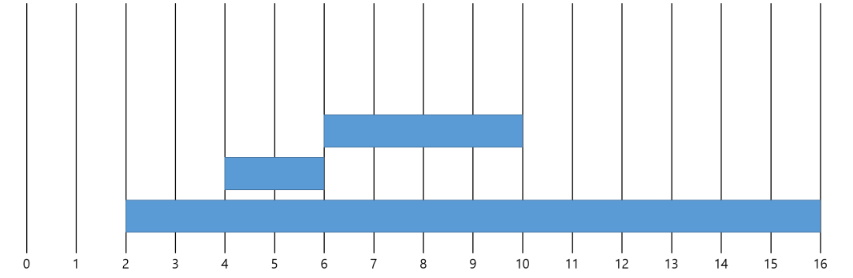
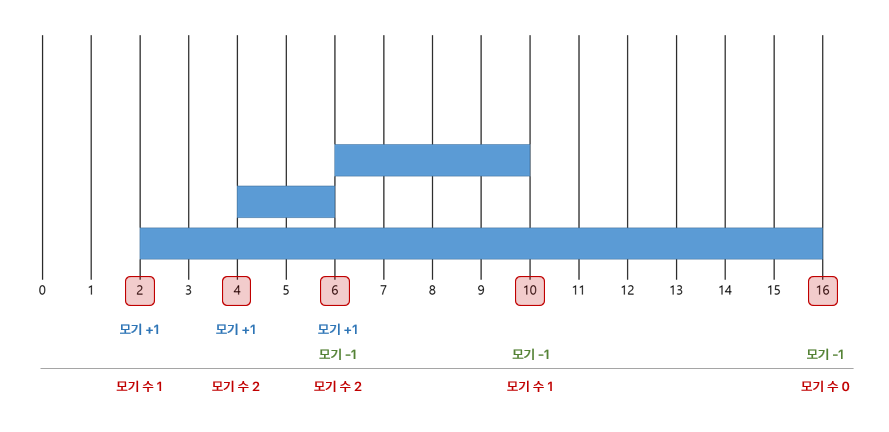

# [BOJ 20440] 니가 싫어 싫어 너무 싫어 싫어 오지 마 내게 찝쩍대지마

https://www.acmicpc.net/problem/20440


## 0. 문제

모기들의 방 입장, 퇴장 시각이 주어졌을 때 **모기들이 가장 많이 있는 시간대**와 해당 시간대에 **모기가 몇 마리가 있는지** 구하는 프로그램을 만들어보자. 

- 첫째 줄에 지동이의 방에 출입한 모기의 마릿수 *N*(1 ≤ *N* ≤ 1,000,000)가 주어진다.
- 다음 *N*개의 줄에 모기의 입장 시각 *TE*과 퇴장 시각 *TX*이 주어진다. (0 ≤ *TE < TX* ≤ 2,100,000,000)
- 모기는 *[TE, TX)*동안 존재한다. 여러 가지 방법이 있으면 가장 빠른 시작 시각을 기준으로 출력한다.


아래 예시에서, 모기가 가장 많은 시간대의 연속 구간은 *[4, 10)* 이고 해당 시간대의 모기의 수는 2마리이다.




## 1. 아이디어

1. 시간을 기준으로 1초, 2초, 3초 ... 때마다의 들어오고 나가는 모기의 수를 구한다.

   - 모기가 들어오고 나갈 때의, 특정 시간만 신경쓴다.

   - **defaultdict를 사용하여 특정 시간에 모기가 들어오면 +1, 나가면 -1을 해서, 모기의 수를 구한다.**
   - 모기가 들어올 때 최댓값이 갱신될 수 있으며, 그 때가 모기가 가장 많이 있는 시간대의 시작이다. 그리고 그 바로 직후 모기가 1마리라도 나갈 때가 시간대의 끝이다.




2. 모기가 들어오고 나가는 시간의 리스트(defaultdict의 key)를 체크해둔다.

   - 범위가 0 ≤ *TE < TX* ≤ 2,100,000,000 으로, 각 시간을 일일이 확인하면 시간 초과가 난다.

   - 미리 체크해둔 특정 시간만 확인한다. 다른 시간동안은 모기의 입출이 없기 때문에 안 봐도 된다.


## 2. 구현

```python
from collections import defaultdict
import sys
input = sys.stdin.readline
# sys.stdin = open("input.txt", "r")

# 모기가 들어오면 +1, 나가면 -1
T = int(input())
IO = defaultdict(int)
for _ in range(T):
    s, e = map(int, input().split())
    IO[s] += 1
    IO[e] -= 1
IO_time = sorted(IO.keys())

max_range = [0, 0]
max_count = -1
end_edit_flag = 0

# 모기의 입출력을 보면서 들어오면 +1, 나가면 -1
current = 0
for time in IO_time:
    current += IO[time]
    
    # 만약 모기가 들어와서 최고값을 갱신하면 새로운 범위로 체크
    if current > max_count:
        max_count = current
        max_range[0] = time
        end_edit_flag = 1

    # 모기가 나갔고 아직 end 범위를 못 정했으면 해당 범위로 체크
    elif end_edit_flag and IO[time] < 0:
        max_range[1] = time
        end_edit_flag = 0

print(max_count)
print(*max_range)
```

- 처음 defaultdict를 사용하지 않고, list를 사용해서 [(모기가 들어온 시간, 1), (모기가 나간 시간, -1), ...] 처럼 저장을 했더니 92%에서 틀렸다. 모기가 들어온 시간과 나간 시간이 같을 때 모기의 수는 변함없으므로 연속으로 판단해야 했는데, 그것이 되지 않아서 틀린 것이었다. (이 경우 예제에서도 틀림)


