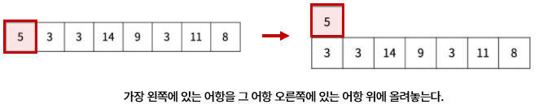
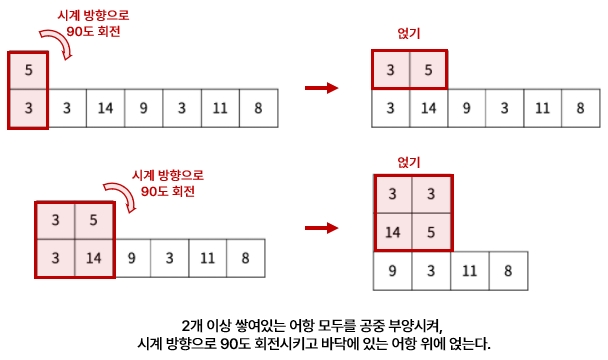
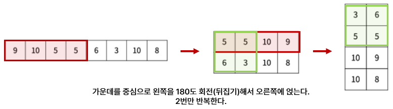
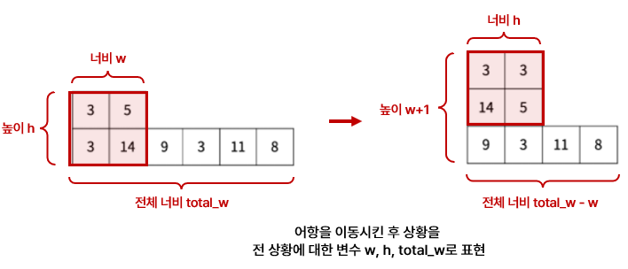
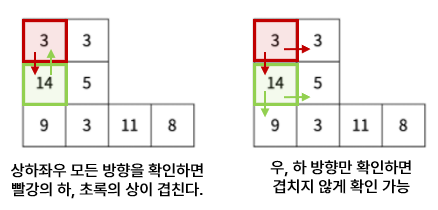
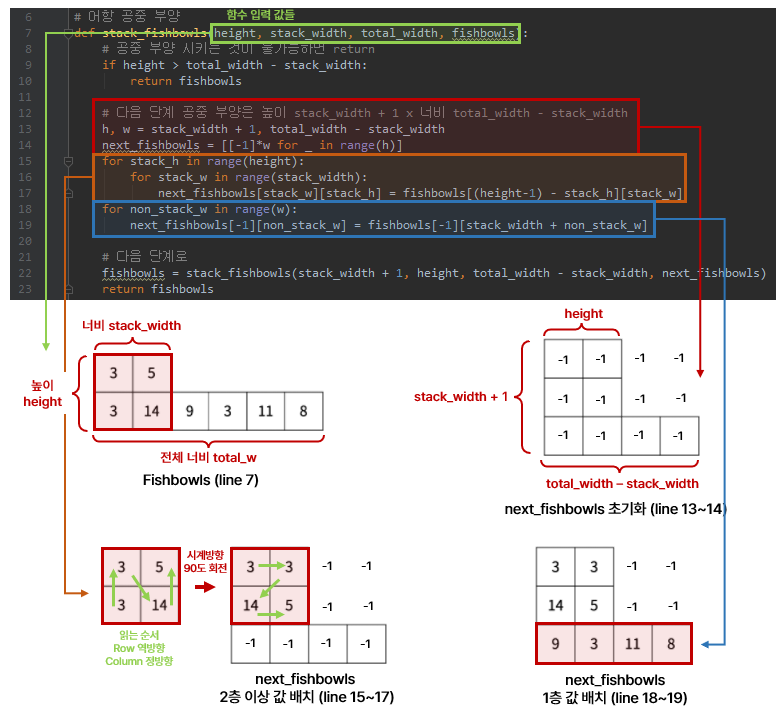

# [BOJ 23291] 어항 정리

https://www.acmicpc.net/problem/23291

<br/>

## 0. 문제

어항을 한 번 정리하는 과정은 다음과 같다. 상어가 가지고 있는 어항은 N개이다. 어항에는 물고기가 한 마리 이상 들어있다.

1. 물고기의 수가 가장 적은 어항에 물고기를 한 마리 넣는다. 그러한 여항이 여러 개면 모두 한 마리씩 넣는다.

2. 어항 공중 부양 작업을 한다.

   - 먼저, 가장 왼쪽에 있는 어항을 그 어항의 오른쪽에 있는 어항 위에 올려 놓는다.

     

   - 2개 이상 쌓여있는 어항 모두를, 공중부양 시켜 시계방향으로 90도 회전시키고 바닥에 있는 어항 위에 올려놓는다. 공중 부양 시키는 것이 불가능할 때까지 반복한다.

     

3. 물고기의 수를 조절한다.

   - 모든 인접한 두 어항에 대해서, 물고기 수의 차이를 구한다. 이 차이를 5로 나눈 몫을 d라고 하자.
   - d가 0보다 크면, 두 어항 중 물고기의 수가 많은 곳에서 적은 곳으로 물고기 d 마리를 보낸다. 

4. 어항 공중 부양 작업을 한다.

   - 가운데를 중심으로 왼쪽 N/2개를 공중 부양시켜 전체를 시계 방향으로 180도 회전 시킨 다음, 오른쪽 N/2개의 위에 놓는다.

   - 이 작업은 두 번 반복한다. 두 번 반복하면 바닥에 있는 어항의 수는 N/4개가 된다.

     

5. 물고기의 수를 조절한다. (위와 동일)

물고기가 가장 많이 들어있는 어항과 가장 적게 들어있는 어항의 물고기 수 차이가 K 이하가 되려면 어항을 몇 번 정리해야 하는가?

<br/>

## 1. 아이디어

시뮬레이션 문제이므로 차례로 구현한다. 1차원 배열로 들어오는 어항을, 공중 부양하면서 2차원 배열로 변환하는 과정을 거친다. 이전에 1차원 배열에 각 어항이 공중 부양할 때, 어디에 맞닿는지 구하려고 했는데 어려워서 2차원 배열로 바꿔 연산하기로 했다.  

1. 물고기 넣기 : 초기 어항 리스트가 한 줄로 들어오기 때문에, min값을 찾아서 +1 해준다.

2. 어항 공중 부양

   - 2개 이상 쌓여있는 어항이 있을 때 (1차원 배열이 아닐 때) 항상 같은 로직이므로 **재귀** 사용

   - 어항을 이동시킨 후 상황을 **전 상황에 대한 변수로 표현**하여 2차원 빈 리스트를 만들고, 빈 리스트에 순차적으로 값을 입력한다.

     

3. 물고기 수 조절

   - 2차원 배열에 대해 인접한 어항들끼리 비교하여 물고기를 추가하거나 뺀다.

   - 2차원 배열의 모든 인덱스에 대해 상하좌우로 확인하면 중복되므로, **오른쪽, 아래 방향만 확인**한다. (DP처럼)

     

4. 어항 공중 부양2

   - 2회 밖에 하지 않으므로 2차원 빈 리스트를 만들어서 순차적으로 값을 입력한다.

5. 물고기 수 조절 (위와 동일)

<br/>

## 2. 전체 코드

```python
import sys
sys.stdin = open("input.txt", "r")


# 어항 공중 부양
def stack_fishbowls(height, stack_width, total_width, fishbowls):
    # 공중 부양 시키는 것이 불가능하면 return
    if height > total_width - stack_width:
        return fishbowls

    # 다음 단계 공중 부양은 높이 stack_width + 1 x 너비 total_width - stack_width
    h, w = stack_width + 1, total_width - stack_width
    next_fishbowls = [[-1]*w for _ in range(h)]
    for stack_h in range(height):
        for stack_w in range(stack_width):
            next_fishbowls[stack_w][stack_h] = fishbowls[(height-1) - stack_h][stack_w]
    for non_stack_w in range(w):
        next_fishbowls[-1][non_stack_w] = fishbowls[-1][stack_width + non_stack_w]

    # 다음 단계로
    fishbowls = stack_fishbowls(stack_width + 1, height, total_width - stack_width, next_fishbowls)
    return fishbowls


# 어항 공중 부양 2
def stack_fishbowls2(fishbowls):
    # 1회 어항 쌓기
    top = fishbowls[:N//2][::-1]
    down = fishbowls[N//2:]
    fishbowls = [top, down]

    # 2회 어항 쌓기
    half = len(top) // 2
    next_fishbowls = [[0] * half for _ in range(4)]
    # 왼쪽 절반은 공중부양
    for r in range(2):
        for c in range(half):
            next_fishbowls[r][c] = fishbowls[1-r][half-1-c]

    # 오른쪽 절반은 그대로
    for r in range(2):
        for c in range(half, len(top)):
            next_fishbowls[r+2][c-half] = fishbowls[r][c]

    return next_fishbowls


# 어항에 있는 물고기 수 조절
def fish_count(fishbowls):
    R, C = len(fishbowls), len(fishbowls[0])
    next_fishbowls = [i[:] for i in fishbowls]

    for r in range(R):
        for c in range(C):
            # 비어있으면 패스
            if fishbowls[r][c] == -1:
                continue
                
            # 상하좌우가 아닌 오른쪽, 아래 방향만 확인한다.
            for dr, dc in [(0, 1), (1, 0)]:
                nr = r + dr
                nc = c + dc
                # 범위 내이고, 물고기가 있는 어항이면
                if 0 <= nr < R and 0 <= nc < C and fishbowls[nr][nc] != -1:
                    fish_diff = fishbowls[r][c] - fishbowls[nr][nc]
                    # 5로 나눈 몫이 1 이상이면
                    d = abs(fish_diff) // 5
                    if d > 0:
                        # 양수이면, r,c 에 있는 물고기가 많다.
                        if fish_diff > 0:
                            next_fishbowls[r][c] -= d
                            next_fishbowls[nr][nc] += d
                        else:
                            next_fishbowls[r][c] += d
                            next_fishbowls[nr][nc] -= d

    # 일렬로 놓기
    result = []
    for c in range(C):
        for r in range(R-1, -1, -1):
            if next_fishbowls[r][c] != -1:
                result.append(next_fishbowls[r][c])

    return result


N, K = map(int, input().split())
fishbowls = list(map(int, input().split()))

result = 0
fish_diff = float('inf')
while K < fish_diff:

    # 1. 물고기 수가 가장 적은 어항에 한 마리 넣는다.
    fish_min = min(fishbowls)
    for idx in range(len(fishbowls)):
        if fishbowls[idx] == fish_min:
            fishbowls[idx] += 1

    # 2. 어항을 쌓는다.
    top = [fishbowls.pop(0)] + [0] * (len(fishbowls) - 1)
    next_fishbowls = [top, fishbowls]
    fishbowls = stack_fishbowls(2, 1, len(fishbowls), next_fishbowls)

    # 3. 물고기 수 조절
    fishbowls = fish_count(fishbowls)

    # 4. 두 번째 방법으로 어항을 쌓는다.
    fishbowls = stack_fishbowls2(fishbowls)

    # 5. 물고기 수 조절
    fishbowls = fish_count(fishbowls)

    # 6. 물고기 가장 많은 어항, 적은 어항 차이 확인
    fish_diff = max(fishbowls) - min(fishbowls)

    # 어항 정리 횟수
    result += 1

print(result)

```

처음에 놓쳐서 틀렸었던 부분

- 물고기 수 조절하는 fish_count 함수 부분에서, 2차원 배열의 모든 인덱스에 대해 상하좌우로 확인하면 중복된다. 문제를 해결하기 위해 오른쪽, 아래 방향만 확인하였다. 

어항 공중 부양1 stack_fishbowls 추가 설명


