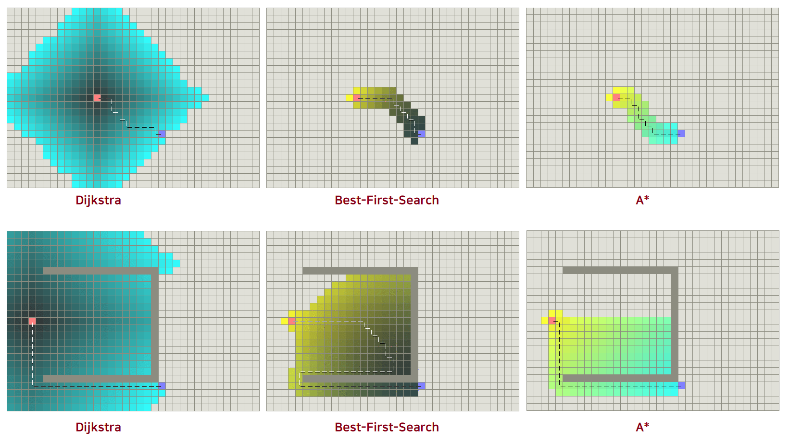

- A* 알고리즘
- D* 알고리즘
- JSP 알고리즘

<br/>

# A* 알고리즘

1. A* 알고리즘 이란 ?

   - 주어진 출발 꼭짓점에서부터 목표 꼭짓점까지 가는 최단 경로를 찾아내는 그래프 탐색 알고리즘 중 하나이다. 다익스트라 알고리즘과 유사하나, **차이점은 각 꼭짓점 x에 대해 그 꼭짓점을 통과하는 최상의 경로를 추정하는 순위값인 휴리스틱 h(x)** 을 이용한다는 것이다.

   - A* 알고리즘은 출발 꼭짓점으로부터 목표 꼭짓점까지의 최적 경로를 탐색하기 위한 것이다. 이를 위해서는 각각의 꼭짓점에 대한 평가 함수를 정의해야 한다. 이를 위한 평가 함수는 다음과 같다.

     - g(n) : 출발 꼭짓점으로부터 꼭짓점 n까지의 경로 가중치 (시작 ~ n 노드 까지 부하량)
     - h(n) : 꼭짓점 n으로부터 목표 꼭짓점까지의 추정 경로 가중치 (n ~ 목표 노드 까지 추정 부하량)

     $$
     f(n) = g(n) + h(n)
     $$

2. Heuristics for grid maps

   - grid map & distance
     - square grid 4방향 : Manhattan distance
     - square grid 8방향 : Diagonal distance
     - square grid 모든 방향 : Euclidean distance
     - hexagon grid 6방향 : Manhattan distance adapted to hexagonal grids
   - you **avoid the expensive square root** in the Euclidean distance by using distance-squared
     - **[Do not do this](http://theory.stanford.edu/~amitp/GameProgramming/Heuristics.html#euclidean-distance-squared)** : g와 h의 scale은 같아야한다. (g+h로 f를 사용하니까)
     
     - h를 그냥 제곱수로 사용하면 먼 거리에서 g의 기여가 매우 낮아지고 A*는 Greedy Best-First-Search가 된다. 하지만 휴리스틱을 축소하면 짧은 거리의 경우 h의 기여가 매우 낮아 Dijkstra가 된다.
     
     - If, after profiling, you find the cost of the square root is significant, either use a fast square root approximation with Euclidean distance or use the diagonal distance as an approximation to Euclidean.
     
     - [비교](http://theory.stanford.edu/~amitp/GameProgramming/AStarComparison.html#dijkstras-algorithm-and-best-first-search) : 위는 장애물 X / 아래는 장애물 O
     
       
   - [Speed or accuracy?](http://theory.stanford.edu/~amitp/GameProgramming/Heuristics.html#speed-or-accuracy)
     -  you **don’t really need the best path** between two points. [You need something that’s close](http://realtimecollisiondetection.net/blog/?p=56)

3. A* 구현

   - state list : Open list (조사하지 않은 상태) & Close list (조사를 마친 상태)

   - 의사코드

     ```python
     # 우선순위 큐에 시작 노드를 삽입한다.
     pq.enqueue(start_node, g(start_node) + h(start_node))
     
     # 우선순위 큐가 비어있지 않은 동안
     while pq is not empty:
         # 우선순위 큐에서 pop한다
         node = pq.dequeue
         
         # 만약 해당 노드가 목표 노드면 반복문 탈출
         if node == goal_node:
             break
             
         # 해당 노드에서 이동할 수 있는 다음 노드들을 보는 동안
         # 우선순위 큐에 다음 노드를 삽입한다
         for next_node in (next_node_begin ... next_node_end):
             pq.enqueue(next_node, g(node) + cost + h(next_node))
     
     # 시작 노드에서 목표 노드까지의 거리를 출력한다.
     return goal_node_dist
     ```

4. 8-puzzle problem

   - f(n) = g(n) + h(n)
     - g(n) : 현재까지의 값, 즉 지금까지 움직인 횟수
     - h(n) : 앞으로 예상되는 값, 제자리에 있지 않은 퍼즐의 수

   

<br/>

# D* 알고리즘

킵

<br/>

# JPS 알고리즘

킵

<br/>

# 참고 자료

1. 유튜브 A* 강의
   - [★아무거나 물어보살: A* (에이스타) 알고리즘이 궁금해요. 궁금하면 못참지!]( https://www.youtube.com/watch?v=pUZhNMAqLbI)
   - [★[길찾기 알고리즘] A*냐 JPS냐 ... 그것이 문제로다!ㅣ지피직스 알고리즘.zip EP.1](https://www.youtube.com/watch?v=rfOgaPXCADQ) JPS 신기해서
   - [8-퍼즐 문제와 A* 알고리즘: 1. 문제의 이해](https://www.youtube.com/watch?v=hfYQYRFM874)
   - [[6주차] 인공지능의 기본- 탐색 예시(8-퍼즐-파이썬 구현 완성-A*알고리즘활용)](https://www.youtube.com/watch?v=tftqPpbKNcU)
2. 일반 글
   - [★파이썬 A* 최단경로 찾기 알고리즘](https://choiseokwon.tistory.com/210) 시각화가 좋다
   - [★Heuristics for grid maps](http://theory.stanford.edu/~amitp/GameProgramming/Heuristics.html#heuristics-for-grid-maps) 설명이 잘 됨
   - [★A*  Algorithm](http://www.aistudy.com/heuristic/A_star.htm)
   - [A* 알고리즘](https://code-loving.tistory.com/entry/A%EC%95%8C%EA%B3%A0%EB%A6%AC%EC%A6%98) 수도코드 설명이 잘 됨
3. 킵
   - [A* 알고리즘 평가함수의 추정 부하량 변경에 관한 연구](https://scienceon.kisti.re.kr/commons/util/originalView.do?cn=JAKO201521159149517&oCn=JAKO201521159149517&dbt=JAKO&journal=NJOU00294870)
   - [A* (a-star) 알고리즘 휴리스틱 (Weighted A*)](https://enghqii.tistory.com/29)

