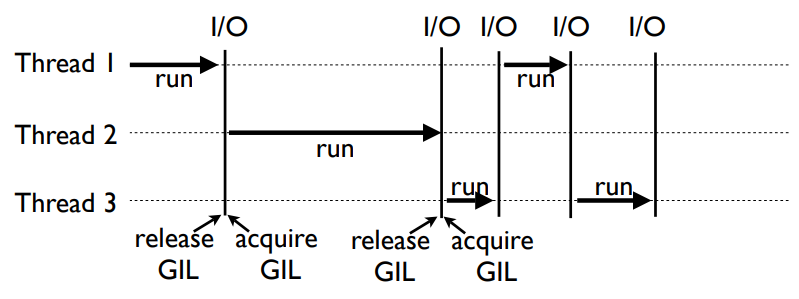

# [Python] GIL (Global Interpreter Lock)

## GIL 이란?

> An interpreter that uses GIL always allows exactly one thread to execute at a time, even if run on a multi-core processor. Some popular interpreters that have GIL are CPython and Ruby MRI.

위키에서는 GIL을 위처럼 정의했다. 인터프리터는 코드를 한 줄씩 읽으면서 실행시키는 것인데, 이 GIL을 가진 인터프리터는 **한 시점에 단 하나의 스레드만 실행**시킬 수 있는 것이다. 그리고 CPython은 GIL을 사용하고 있다.

그래서 파이썬의 경우 멀티 스레딩을 바라고 사용해도 효율이 잘 안 나올 때가 있다. 하나의 스레드가 GIL을 가지고 있다가 release 되고 다른 스레드가 GIL를 얻어야만 일을 할 수 있기 때문이다. 심지어 그 사이에 context switching 때문에 overhead가 늘어나서 역효과가 날 수도 있다. 

## GIL을 쓰는 이유

Python의 Garbage Collection은 Reference Count 형태로 진행된다. Reference Count는 객체가 참조되면 값을 늘리고, 더 이상 사용하지 않게 되면 값을 줄이는 방식으로 해당 값이 0이 되면 유효한 객체로 보지 않아 메모리에서 제거한다.

Reference Count를 채택하는 Python의 경우 GIL이 없다면, 여러 스레드가 하나의 자원에 접근할 수 있고 Race Condition에 빠질 수 있다. A, B 스레드가 동시에 객체에 접근해서, A 스레드가 Reference Count를 0으로 만들어 객체를 release 시켰는데 B 스레드가 해당 객체에 접근하려고 할 때 같이 문제가 생길 수 있다.

이 같은 문제를 해결하기 위해 Python은 공유 자원에 하나의 스레드만 접근할 수 있도록, thread-safe 하게 하기 위해서 GIL을 걸어버렸다.

애초에 왜 이렇게 만들었냐고 하면 Python을 처음 개발할 때 당시 CPU는 한 개 여서 멀티 코어를 고려하지 않았고, 스레드라는 개념 자체가 희미했다고 한다.

## 파이썬 멀티 스레드

파이썬 멀티 스레드 어떻게 쓰냐고 하면 멀티 프로세스나 쓰라고 하는 답변이 달리지만 완전 폐기물은 아니고(과연?) CPU 연산보다 I/O 작업이 많은 경우에 사용할 수 있다.

GIL을 해결하기 위한 노력은 아직까지도 계속되고 있다고 하고... python2에서는 싱글 스레드로 하는 것이 듀얼 스레드로 하는 것보다 빨랐는데, python3에서는 미미하게 싱글 스레드가 빨라졌다고 한다. 하지만 멀티 프로세스를 만들어서 하는게 낫다!

## 참고 자료

- [H3 2011 파이썬으로 클라우드 하고 싶어요_분산기술Lab_하용호](https://www.slideshare.net/kthcorp/h32011c6pythonandcloud-111205023210phpapp02?from_m_app=ios)
- [[Python 3.4] 멀티쓰레딩과 멀티프로세싱](https://mydb.tistory.com/245)
- [Understanding the Python GIL](https://dabeaz.com/python/UnderstandingGIL.pdf)