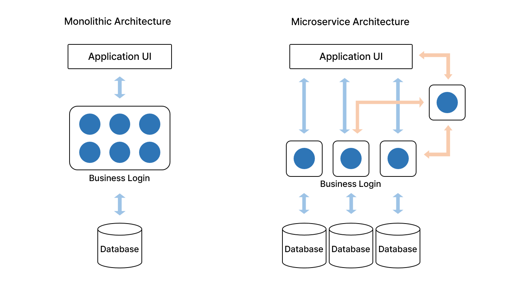

# Monolithic Architecture 

- 마이크로 서비스 아키텍처의 반대, 전통적인 아키텍처
- 하나의 서비스 또는 애플리케이션을 하나의 거대한 아키텍처로 구성
- 모든 혹은 대부분의 서비스 및 구성 요소들이 한 곳에 모여있을 때

장점

1. 개발이 쉽다. 소규모 프로젝트에 알맞다.
2. 어떤 서비스든지 개발하는 환경이 같아서 복잡하지 않다.
3. End-to-End 테스트가 쉽다.
4. 로드 밸런서 등을 이용하면 확장이 쉽다.
5. 서버에 코드를 복사하기만 하면 돼서 배포가 쉽다.
6. 서버 하나를 통째로 복사하면 되니 전체적인 Scale Out 이 쉽다. 

단점

1. 사용할 기술 스택이 처음에 결정되고 변경되는 경우는 거의 없다.
2. 일부 서비스의 장애로 인해 전체 서비스에 장애가 생길 수 있다. 
3. 애플리케이션이 너무 거대해지면 초기 개발자를 제외하고는 완전히 이해하기 어렵다.
4. 위 이유로, 새로운 개발자가 이전 코드를 이해하는 데 시간이 오래 걸려 개발 속도가 느려진다. 
5. 작은 수정사항에도 전체를 다시 빌드 및 배포를 해야하며 규모가 커질수록 오래 걸린다.
6. 일부 서비스가 폭주해도 서버 전체를 Scale Out 해야해서, 부분적인 Scale Out이 어렵다.
7. 높은 결합도를 가진다.

#  Micro Service Architecture 

- 애플리케이션을 상호 독립적인 최소 구성 요소로 분할
- 하나의 큰 애플리케이션을 여러 개의 작은 애플리케이션으로 쪼개어 변경과 조합이 가능하도록 만든 아키텍처

장점

1. 각 서비스에 맞는 기술, 언어 등을 선택하여 개발할 수 있다.
2. 일부 서비스의 장애가 전체로 퍼지지 않는다.
3. 작은 애플리케이션으로 나뉘다보니 각 기능의 규모가 작아져서 이해 및 관리가 용이하다.
4. 위 이유로, 코드량이 적기 때문에 새로운 개발자도 코드를 빨리 이해하여 개발 속도가 빠르다.
5. 독립적인 서비스로 배포가 빠르고 전체 서비스를 중단하지 않아도 된다.
6. 부분적인 Scale Out이 가능하여 메모리 및 CPU 관리에 효율적이다.

단점

1. 분산 시스템 개발은 일반 개발보다 복잡하고 관리가 어렵다.
2. 각 서비스의 테스트는 쉽지만 연결된 다른 서비스 간의 테스트가 어렵다.
3. 서비스마다 분리된 DB들 간의 트랜잭션 관리가 어렵다.
4. 서비스간 네트워크 통신으로 인한 제약, 비용, 오류 및 지연이 발생할 수 있다.
5. 여러 서비스에 걸친 기능을 배포할 때 각 서비스간 조율이 필요하다.

## 참고

[당신의 MSA는 안녕하신가요? MSA를 보완하는 아키텍처: EDM(Event Driven MicroService)](https://www.samsungsds.com/kr/insights/msa_architecture_edm.html)

[가상 스타트업으로 알아보는 MSA이야기](https://covenant.tistory.com/176)

