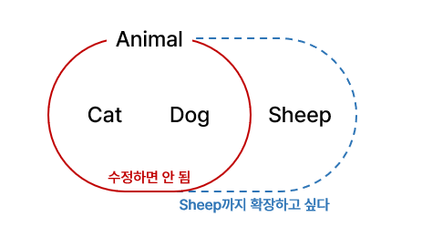
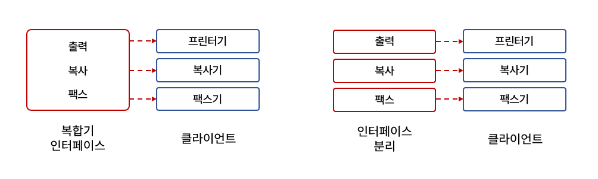
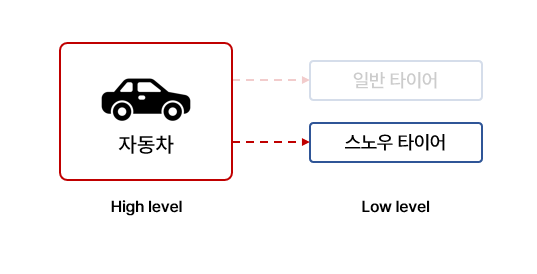
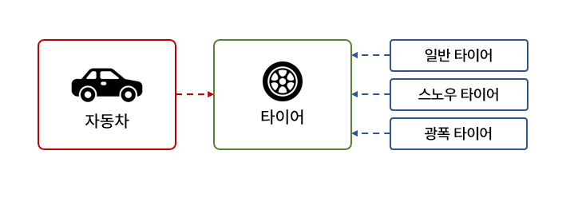

# SOLID

로버트 마틴의 객체 지향 5대 원칙은 올바른 객체 지향 프로그래밍 및 설계를 위한 다섯 가지 기본 원칙이다.

프로그래머가 읽기 쉽고 시간이 지나도 유지 보수와 확장이 쉬운 시스템을 만들 수 있도록 한다.


객체 지향 5대 원칙 (SOLID)

- 단일 책임 원칙 (Single responsibility principle)
- 개방-폐쇄 원칙 (Open/closed principle)
- 리스코프 치환 원칙 (Liskov substitution principle)
- 인터페이스 분리 원칙 (Interface segregation principle)
- 의존관계 역전 원칙 (Dependency inversion principle)


## 1. 단일 책임 원칙 (Single responsibility principle)

- 한 클래스는 단 하나의 책임만 가져야 한다.
- 클래스를 변경하는 이유는 단 하나여야만 한다.
- 응집도는 높게, 결합도를 낮게 한다.

로버트 마틴은 **책임을 변경하려는 이유로 정의**하고, 어떤 클래스나 모듈은 변경하려는 단 하나 이유만을 가져야 한다고 결론 짓는다. 이를 위배하고 클래스가 여러 개의 책임을 가지고 있다면, 새로운 기능이 추가, 수정되어 클래스를 수정해야하게 됐을 때 연쇄적으로 클래스를 수정하게 될 수 있다. 이는 곧 클래스의 재사용, 수정 및 유지 보수를 어렵게 한다.


`강아지` 라는 클래스에 다음과 같은 함수가 있다고 생각하자.

1. 강아지의 이름을 정하는 함수
2. 강아지의 나이을 정하는 함수
3. 누구의 강아지인지 확인하는 함수

위 예시는 SRP가 지켜지지 않은 예시이다. 강아지의 속성을 정하는 책임과 누구의 강아지인지 확인하는 책임 두 가지를 가지고 있기 때문이다. 하지만 강아지의 이름을 정하는 함수와 나이를 정하는 함수는 강아지의 속성 값을 변경하는 것 뿐이기에 다른 책임으로 고려하지는 않는다.

<br/>

## 2. 개방-폐쇄 원칙 (Open/closed principle)

- 소프트웨어 개체는 확장에 대해 열려있어야 한다.
- 소프트웨어 개체는 수정에 대해 닫혀있어야 한다.

소프트웨어 개체(클래스, 모듈, 함수 등등)은 확장에는 열려 있어야 하고 수정에 대해 닫혀있어야 한다. 이 말은 곧, **개체는 수정 및 확장이 가능 해야 하지만, 그 기능을 사용하는 코드는 수정되지 말아야 한다**. 라는 뜻이다. OCP는 하나의 수정이 다른 곳의 연쇄적인 변화를 일으키는 것을 막기 위해 만들어졌다.


[다음 예시](https://www.youtube.com/watch?v=EmnIdUvTRfk&list=PLDV-cCQnUlIZcWXE4PrxJx6U3qKfRTJcK&index=3)에서 Cat과 Dog를 만들어서 함수를 호출하면 정상 동작한다. 하지만 이 상태로 Sheep를 만들어서 hey(sheep)를 사용하려고 하면 에러가 발생한다.

```python
# OCP 위배
class Animal():
  def __init__(self,type):
    self.type = type

def hey(animal):
  if animal.type == 'Cat':
    print('meow')
  elif animal.type == 'Dog':
    print('bark')

bingo = Animal('Dog')
kitty = Animal('Cat')

hey(bingo)
hey(kitty)

# 에러 발생
sheep = Animal('Sheep')
hey(sheep)
```



OCP에 위배되지 않도록 작성하기 위해서는 다음과 같이 작성해야 한다. 이와 같은 식으로 작성하면 `hey`함수를 수정하지 않으면서 확장이 가능하다.

```python
# OCP 만족
class Animal: 
  def speak(self):  #interface method
    pass

class Cat(Animal):
  def speak(self):
    print("meow")

class Dog(Animal):
  def speak(self):
    print("bark")

class Sheep(Animal):
  def speak(self):
    print("meh")

def hey(animal):
  animal.speak();


bingo = Dog()
kitty = Cat()
sheep = Sheep()

hey(bingo)
hey(kitty)
hey(sheep)
```

<br/>

## 3. 리스코프 치환 원칙 (Liskov substitution principle)

- S: 자식, T: 부모 타입일 때, 부모 타입인 T의 객체는 자식 타입인 S로 치환 가능해야 한다.

LSP를 위반하는 전형적인 예로 직사각형과 정사각형이 있다. 

정사각형은 직사각형에 속하므로 정사각형-자식, 직사각형-부모 라고 생각 할 수 있다. 하지만 이들의 메서드 동작은 다르다. **직사각형의 너비와 높이는 독립적으로 변할 수 있지만 정사각형의 경우, 너비가 바뀌면 높이도 함께 바뀌기 때문에 독립적으로 변할 수 없다**. 따라서 LSP를 위반한다.

위 문제를 해결하기 위해 정사각형의 너비, 높이를 변경하는 메서드를 수정한다면 OCP를 위반하게 된다.

<br/>

## 4. 인터페이스 분리 원칙 (Interface segregation principle)

- 특정 클라이언트를 위한 인터페이스 여러 개가 범용 인터페이스 하나보다 낫다.
- 클라이언트가 자신이 이용하지 않는 메서드에 의존하면 안 된다.
- 큰 덩어리의 인터페이스들을 구체적이고 작은 단위들로 분리시켜라

인터페이스는 **해당 인터페이스를 사용하는 클라이언트를 기준으로 분리**해야한다. 



위와 같이 복합기 인터페이스에는 출력, 복사, 팩스 기능이 있다고 생각하자.

프린터기는 출력 기능만, 복사기는 복사 기능만, 팩스기는 팩스 기능만 사용한다. 그럼에도 불구하고 출력, 복사, 팩스 기능을 모두 갖는 인터페이스를 가져갈 때 ISP를 위반하게 된다. 복사기에 문제가 생겨 복사 기능을 수정해야하게 될 때, 프린터기는 복사 기능을 사용하지 않음에도 같은 인터페이스를 사용하여 문제가 생길 수 있게 된다.

ISP를 만족시키기 위해서 **큰 덩어리의 인터페이스들을 분리**해야 한다. 이 때, 인터페이스는 해당 인터페이스를 사용하는 클라이언트를 기준으로 분리하면 된다. 만약 복합기 클라이언트를 만들고 싶다면 출력, 복사, 팩스 세 가 가지 인터페이스를 가져가도록 하면 된다.

<br/>

## 5. 의존관계 역전 원칙 (Dependency inversion principle)

- 상위 모듈은 하위 모듈에 의존해서는 안된다. 상위 모듈과 하위 모듈 모두 추상화에 의존해야 한다.
- 추상화는 세부 사항에 의존해서는 안된다. 세부사항이 추상화에 의존해야 한다.
- 자신보다 변하기 쉬운 것에 의존하지 마라



스노우 타이어를 사용하는 자동차는 해당 타이어에 대해 의존하고 있다. 겨우내 스노우 타이어를 사용하던 자동차는 봄이 되어 일반 타이어로 바꾸고자 할 때 영향을 받게 될 것이다. 혹은 자동차에 low level의 광폭 타이어를 추가하고자 할 때 dependency가 추가로 생길 수도 있을 것이다. 이와 같이 상위 모듈이 하위 모듈에 대한 dependency가 커지고 영향을 받게되면 수정 및 유지보수가 어렵게 되며 DIP를 위반한다고 볼 수 있다.



이를 해결하기 위해 위와 같이 설계할 수 있다. 특정 타이어들을 타이어라는 추상화된 인터페이스에 의존하게 만든다. 이렇게 하면 특정 타이어들이 변한다 해도 자동차는 타이어에만 의존하기 때문에, **결론적으로 자동차는 변하지 않는다.**
