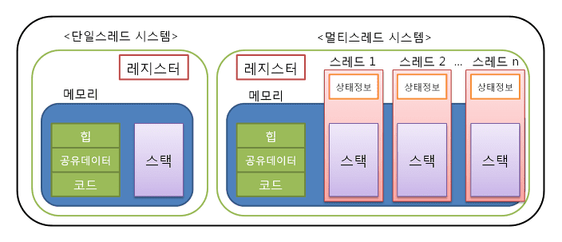

# [OS] 스레드란?

## 스레드란?

**스레드(thread)는 프로세스 내에서 실행되는 흐름의 단위이다.** 프로세스는 최소 한 개 이상의 스레드를 가진다. 여러 개의 스레드를 동시에 실행하는 하나의 작업을 처리하는 방식을 멀티 스레드라고 한다.

스레드는 프로세스의 code, data, heap 영역을 공유하고, stack 영역은 따로 할당받는다.

Thread Control Block (TCB) 의 구성요소

- Thread Identifier: Unique id (tid) is assigned to every new thread
- Stack pointer(SP): Points to thread's stack in the process
- Program counter(PC): Points to the current program instruction of the thread
- State of the thread (running, ready, waiting, start, done)
- Thread's register values
- Pointer to the Process control block (PCB) of the process that the thread lives on

## 스레드의 장점

1. 사용자 응답성

일부 스레드의 처리가 지연되어도 다른 스레드는 작업을 계속 처리할 수 있다. I/O가 세개일 때 (마우스/모니터/헤드셋) , 하나의 스레드/프로세스라면 한 작업을 할 때 다른 작업이 멈춘다. 반면, 스레드가 여러 개 돌아가면서 자원을 공유하면 동시에 여러 작업을 처리할 수 있다.

2. 스레드는 stack 영역만 따로 할당받는다.

프로세스는 code, data, heap, stack 영역으로 구성되어 있다. 반면, **스레드는 프로세스 내에서 stack만 따로 할당받고, 프로세스의 code, data, heap 영역은 공유한다.** 그래서 프로세스의 context switching 비용보다 스레드의 context switching 비용이 더 적고, 프로세스 간 통신(IPC)보다 스레드 간 통신 비용이 더 적다. 자원을 공유함으로써 효율성이 증대되고 경제적이다. 하지만 공유 자원에 여러 스레드가 동시에 접근할 수 있기 때문에 자원을 thread-safe 하게 관리해야 한다.

## 스레드의 단점

1. 스레드들이 긴밀하게 연결되어 있다.

프로세스의 경우 각 프로세스들이 독립적으로 생성된다. 그래서 하나의 프로세스가 죽어도 다른 프로세스는 정상 동작한다. 하지만 스레드는 한 프로세스 내에서 여러 개가 생성되어 긴밀하게 연결되어 있기 때문에, **하나의 스레드가 죽으면 다른 스레드도 영향을 받아 죽게 된다.**

2. 동기화 문제, Critical Section

프로세스의 경우 각 프로세스들이 독립적이다. 반면 스레드의 경우 code, data, heap 영역을 공유한다. 그 탓에 여러 스레드가 하나의 자원에 접근하려고 하면 Race condition 에 빠질 수 있다. 때문에 thread-safe하게 관리해야한다.

