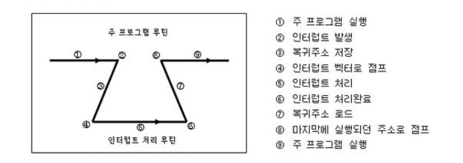
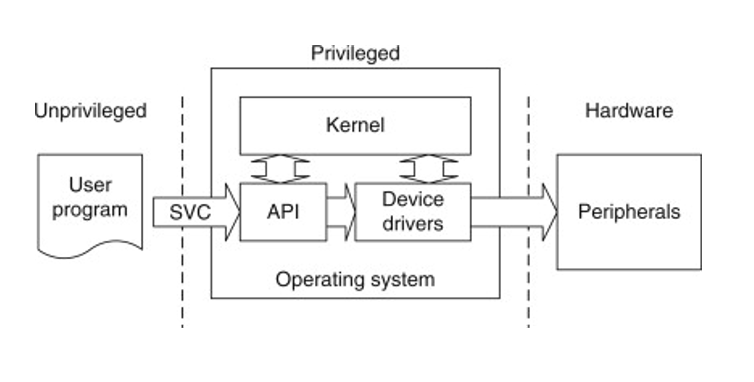

# [OS] 인터럽트 (Interrupt) 란

## 인터럽트(Interrupt)란

> 인터럽트란 CPU(마이크로프로세서)가 프로그램을 실행하고 있을 때, 입출력 하드웨어 등의 장치에 예외상황이 발생하여 처리가 필요할 경우에 CPU에게 알려 처리할 수 있도록 하는 것을 말한다.

즉, 프로그램을 실행하는 도중에 예기치 않은 상황이 발생할 경우, 현재 실행 중인 작업을 중단하고 발생된 상황을 우선 처리한 후 실행 중이던 작업으로 복귀하여 계속 처리하는 것을 말한다.

폴링이 대상을 주기적으로 감시하여 상황이 발생하면 해당 처리 루틴을 실행한다면, 인터럽트는 상대가 CPU에게 일을 처리해 달라고 요청하는 수단이다. 따라서 폴링과 대비되는 개념이다.

## 인터럽트 처리 과정

CPU는 인터럽트를 감지하면 지금 실행 중인 기계어 코드를 중단하고, 해당 인터럽트를 위한 처리 프로그램으로 점프하여 해당 일을 수행한다. 해당 일을 수행 완료하면 복귀 주소로 점프하여 실행 중이던 일을 다시 수행한다.

인터럽트 처리를 위한 루틴을 인터럽트 서비스 루틴(ISR, Interrupt Service Routine) 혹은 인터럽트 핸들러라고 한다. **실제 인터럽트에 대응하여 특정 기능을 처리하기 위한 기계어 코드 루틴이다.** 인터럽트 별로 처리해야 할 내용이 프로그래밍 되어 있다. 운영 시스템이나 임베디드에서 장치 드라이버에서 요구하는 일을 처리하는 기능적 코드 집합으로 콜백 루틴 방식으로 처리한다.

인터럽트 벡터는 인터럽트가 발생했을 때, 해당 인터럽트 서비스 루틴의 시작 주소이다. 인터럽트 벡터 테이블은 여러가지 인터럽트에 대해 인터럽트 서비스 루틴의 주소를 보관하고 있는 테이블이다.

 

### 외부 인터럽트 (HW 인터럽트)

> 외부 인터럽트는 다음과 같이 전원, 기계, 입출력 장치, 타이머 등 CPU 코어 외부 요인으로 발생한다.

- 전원 이상 인터럽트 : 정전 또는 전원 공급의 이상으로 인한 인터럽트
- 기계 이상 인터럽트 : CPU 및 기타 하드웨어 오류로 인한 인터럽트
- I/O 인터럽트 : 입출력의 종료나 오류로 인한 인터럽트
  - 입출력장치가 데이터 전송을 요구하거나 전송이 끝나 다음 동작이 수행되어야 할 경우
  - 입출력 데이터에 이상이 있는 경우
- Timer 인터럽트 : 정해진 시간이 지났을 때 발생하는 인터럽트
- 외부 신호 인터럽트 : 외부 장치로부터의 인터럽트. I/O 인터럽트와는 별개
  - 외부장치로부터 인터럽트 요청이 있는 경우
  - 키보드로 인터럽트 키를 누른 경우(대표적으로 Control + Alt + Delete)
  - 자원이 할당된 시간이 다 끝난 경우 (다중 프로그래밍에서, 임의의 프로세스가 CPU를 사용하기 위한 시간할당이 끝나 프로세스가 종료되는 경우)

 

### 내부 인터럽트

> 내부 인터럽트는 잘못된 명령이나 잘못된 데이터를 사용할 때 발생한다. Trap이라고도 부른다. 인터럽트는  CPU 코어 외부에서 걸리는 외부 인터럽트가 일반적이지만, 내부 인터럽트 처럼 내부에서 걸리는 경우도 있다.

- 프로그램 검사 인터럽트(Program check interrupt)
  - Division by zero
  - Overflow/Underflow
  - 기타 프로그램 Exception

 

### SW 인터럽트 (SVC : Supervisor Call)

- SVC 인터럽트 (Supervisor Call 인터럽트)
  - 사용자가 프로그램을 실행시키거나 Supervisor(=OS)를 호출(call)하는 동작을 수행할 경우
  - 아래 그림에서 user program이 어떠한 명령어도 다 실행시킬 수 있으면 누군가 악의적인 목적으로 사용할 수 있다. 그래서 user program에는 권한이 제한되는데, 그 때문에 SVC를 통해 supervisor에게 명령을 수행해달라고 부탁하는 것이다. (kernel mode = supervisor mode)

 

## 인터럽트 우선순위

여러 장치에서 인터럽트가 동시에 발생하거나 인터럽트 서비스 루틴 수행 중 인터럽트가 발생했을 경우 우선순위를 따진다. 일반적으로 외부 인터럽트 > 내부 인터럽트 > SW 인터럽트 순위를 가진다.

1. 전원 이상(Power fail)
2. 기계 착오(Machine Check)
3. 외부 신호(External)
4. 입출력(I/O)
5. 명령어 잘못
6. 프로그램 검사(Program Check)
7. SVC(SuperVisor Call)

 

## 참고자료

- [위키백과 인터럽트](https://ko.wikipedia.org/wiki/%EC%9D%B8%ED%84%B0%EB%9F%BD%ED%8A%B8)
- [[OS] 1. 인터럽트 (Interrupt)](https://hibee.tistory.com/264)
- [인터럽트](https://itwiki.kr/w/%EC%9D%B8%ED%84%B0%EB%9F%BD%ED%8A%B8)
