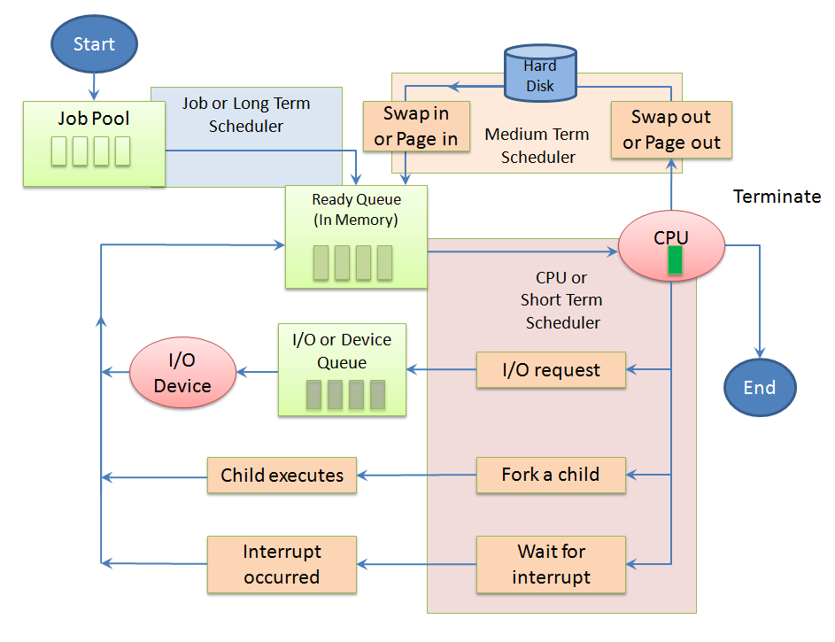
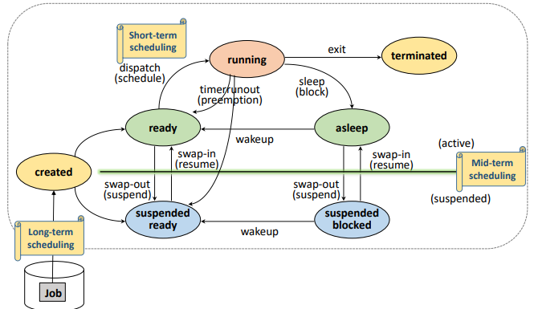
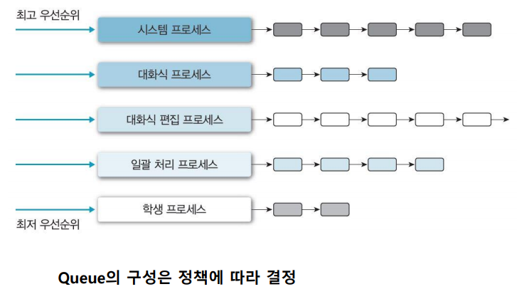
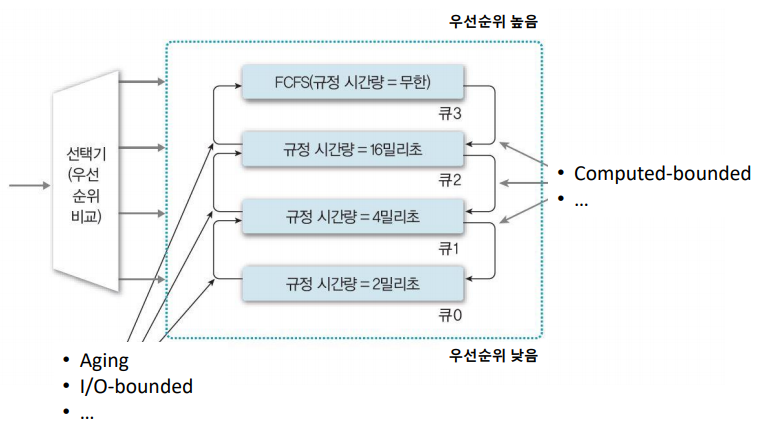

# [OS] 프로세스 스케줄링

## 스케줄링의 목적

일반적으로 프로세스는 CPU를 한 차례 사용(CPU burst)하고 I/O를 한 차례 사용(I/O burst)하는 주기를 반복한다. 따라서 여러 프로세스가 있을 때 한 프로세스가 CPU를 사용하지 않음에도(I/O burst) CPU를 점유하고 있으면 CPU가 낭비되므로, 스케줄링을 통해 CPU 효율을 높이도록 한다.

즉, 스케줄링은 여러 개의 프로세스가 시스템 내에 존재할 때, **다중 프로그래밍에서 자원을 할당할 프로세스를 선택**하기 위해 필요하다.

- 시간 분할 자원 관리 : 하나의 자원을 여러 스레드들이 **번갈아가며 사용** (ex. 프로세서)
- 공간 분할 자원 관리 : 하나의 자원을 **분할하여 동시에 사용** (ex. 메모리)

스케줄러의 종류는 다음과 같다. 요즘에는 **스케줄러라고 하면 일반적으로 단기 스케줄러를 의미**한다. 다른 스케줄러는 사실상 의미가 없어졌기 때문이다.

- 장기 스케줄러: Long-term scheduler 혹은 Job scheduler
- 중기 스케줄러: Medium-term scheduler 혹은 Swapper
- 단기 스케줄러: Short-term scheduler 혹은 CPU scheduler

## 장기, 중기, 단기 스케줄링

스케줄링 기법이 고려하는 항목들은 다음과 같다.

1. 프로세스의 특성 (I/O-bounded or compute-bounded)
   - 프로세스 수행시간 = CPU 사용 시간 (CPU burst) + I/O 대기 시간 (I/O burst)
   - CPU burst가 더 길 때 : computed-bounded . 연산에 의해서 성능이 좌지우지 된다.
   - I/O burst가 더 길 때 : I/O-bounded . I/O에 의해서 성능이 좌지우지 된다.
2. 시스템 특성 (batch system or interative system)
3. 프로세스의 긴급성 (Hard- or soft- real time, non-real time system)
4. 프로세스 우선순위
5. 프로세스 총 실행 시간

### 1. 장기 스케줄링

- Long-term scheduler 혹은 Job scheduler
- **job pool에서 job을 선택하여 ready queue에 적재하는 스케줄러**

장기 스케줄러는 수 십 ~ 수 분 단위로 가끔 호출되기 때문에 상대적으로 **속도가 느린 것이 허용**된다. 또, 스케줄링 시간이 더 걸리더라도 시스템 효율을 위해서 **I/O bounded 와 compute-bounded 프로세스들을 잘 섞어서** 선택한다.

다만, 현대의 시분할 시스템에서는 모든 작업을 시스템에 등록하기 때문에 장기 스케줄링은 덜 중요해졌다.

### 2. 중기 스케줄링

- Medium-term scheduler 혹은 Swapper
- **메모리에 적재된 프로세스를 관리하는 스케줄러**

메모리에 적재된 프로세스가 매우 많아지면 한 프로세스 당 보유하고 있는 메모리 양이 매우 적어질 수 있다. 그 탓에 CPU 수행에 필요한 프로세스의 메모리 공간조차 확보가 안 될 수 있기 때문에 swap out하는 과정이 필요하며 이를 행해주는 것이 중기 스케줄러이다.

디스크로 swap out 시켜야 하는 경우, asleep 상태에 있는 프로세스들을 먼저 swap out하고 (당장 CPU를 획득할 가능성이 없기 때문) 그 후에 문제가 해결되지 않는 경우 ready queue로 이동하는 프로세스를 추가적으로 swap out 시킨다.

- suspended ready : created ~ ready 에서 swap out
- suspended block : asleep 에서 swap out

단기, 장기 스케줄러 이후 생긴 스케줄링이나, 장기 스케줄러와 마찬가지로 현재에는 사용하지 않게 된 스케줄러이다.

### 3. 단기 스케줄링

- Short-term scheduler 혹은 CPU scheduler
- **ready queue에 적재된 프로세스들 중 하나를 선택해 CPU를 할당해주는 스케줄러**

단기 스케줄러는 스케줄링 알고리즘에 따라 프로세스들 중 하나를 선택해 CPU를 할당해주며 **매우 빨라야**한다. 타이머 인터럽트가 발생하면 단기 인터럽트가 호출된다. 요즘 스케줄러라고 하면 일반적으로 단기 스케줄러를 의미한다.

## 스케줄링의 정책

### 1. 선점 vs 비선점

- Preemptive(선점) : 타의에 의해 자원을 빼앗길 수 있음 (할당시간 종료, 우선순위 높은 프로세스 등장)

  - 장) 응답성이 높음 (Time-sharing system, real-time syatem 등에 적합)
  - 단) Context switch overhead가 큼

- Non-Preemptive(비선점) : 할당받을 자원을 

  스스로 반납할 때까지

   사용 (뺏기지 않음. system call, I/O 등)

  - 장) Context switch overhead가 적음
  - 단) 잦은 우선순위 역전(우선순위 높은 일을 먼저 처리 못 함), 평균 응답시간 증가

### 2. 우선순위

- Static priority (정적 우선순위) : 프로세스 생성시 결정된 priority가 유지
  - 장) 구현이 쉽고, overhead가 적음
  - 단) 시스템 환경 변화에 대한 대응이 어려움
- Dynamic priority (동적 우선순위) : 프로세스 상태 변화에 따라 priority가 변경
  - 장) 시스템 환경 변화에 유연한 대응 가능
  - 단) 구현이 복잡, priority 재계산 overhead가 큼

## 스케줄링 알고리즘

### 1. FCFS (First-Come-First-Service)

- **ready queue에 도착하는 시간 기준으로, 먼저 도착한 프로세스를 먼저 처리한다.**
- Non-preemptive scheduling
- Batch system에 적합, interative system, 대화형 시스템에 부적합
- 장점
  - 스케줄링의 구현이 쉽다.
  - 자원을 효율적으로 사용 가능하다: 도착한 대로 프로세서에게 할당하면 돼서 불필요한 스케줄링 오버헤드가 없다.
  - ready queue에 있는 모든 프로세스가 실행되므로 starvation이 없다.
- 단점
  - **Convoy effect**: 긴 평균 응답 시간을 갖는다. 한 프로세스의 수행 시간이 길면 다른 프로세스의 대기 시간이 길어진다.

### 2. RR (Round-Robin)

- ready queue에 도착하는 시간 기준으로, **먼저 도착한 프로세스를 먼저 처리한다. 단, 자원의 사용 제한 시간**이 있다. 프로세스는 할당된 시간이 지나면 자원을 반납해야 한다.
- 제한 시간이 무한대가 되면 FCFS가, 0에 가까워지면 프로세서를 동시에 쓰는 느낌을 준다.
- 원형 큐로 설계되어 프로세스가 시간을 다 쓰면 OS가 인터럽트를 걸어 현재 PCB가 큐의 가장 뒤로 간다.
- Preemptive scheduling
- 대화형, 시분할 시스템에 적합
- 장점
  - ready queue에 있는 모든 프로세스가 실행되므로 starvation이 없다.
- 단점
  - Context switching 오버헤드가 크다.
  - 하드웨어 타이머가 필요하다.

### 3. SPN (Shortest-Process-Next) 혹은 SJF (Shortest-Job-First)

- **실행 시간이 적은 프로세스를 먼저 처리한다.**
- Non-preemptive scheduling
- 장점
  - 평균 대기 시간의 최소화
  - 시스템 내 프로세스 수 최소화: 스케줄링 부하 감소, 메모리 절약, 시스템 효율 향상
  - 많은 프로세스들에게 빠른 응답 시간 제공
- 단점
  - starvation : 실행 시간이 긴 프로세스는 자원 할당을 못 받을 수 있다.
  - 정확한 실행 시간을 알기 어렵다.

### 4. SRTN (Shortest Remaining Time Next)

- **잔여 실행 시간이 더 적은 프로세스가 ready 상태가 되면 선점한다.**
- preemptive scheduling
- 장점
  - SPN의 장점을 갖는다.
- 단점
  - 프로세스 생성 시 총 실행 시간 예측이 필요하고, 잔여 실행 시간을 계속 추적해야 하여 오버헤드가 크다. 그래서 구현 및 사용이 비현실적이다.

### 5. HRRN (High-Response-Ratio-Next)

- **실행 시간이 적을수록, 대기 시간이 길수록 우선순위가 높아지며 해당 프로세스를 먼저 처리한다.** (Waiting time + Burst time) / Burst time이 기준이다.
- Aging concepts : 프로세스의 대기 시간(Waiting time)을 고려한다
- Non-preemptive scheduling
- 장점
  - SPN의 장점을 갖는다.
  - starvation을 방지할 수 있다.
- 단점
  - 실행 시간을 예측할 수 있는 기법이 필요하며 오버헤드가 크다.

### 6. MLQ (Multi-level Queue)

- 작업 혹은 우선순위 별로 ready queue가 존재하며 자신만의 스케줄링 기법이 있다.
  - 최초 배정된 queue를 벗어나지 못한다.
  - queue 사이에는 우선순위 기반의 스케줄링을 사용한다.
- 장점
  - 우선순위가 높은 프로세스는 빠르게 응답 시킬 수 있다.
- 단점
  - 여러 개의 queue 관리하는 스케줄링 오버헤드가 크다.
  - 우선순위가 낮은 queue는 starvation 현상이 발생할 수 있다.

### 7. MFQ (Multi-level Feedback Queue)

- queue간 이동이 허락된 MLQ로, feedback을 통해 우선순위를 조정할 수 있다.
  - MLQ 에서 프로세서를 선점하지 못하는 프로세스를 높은 레벨의 ready queue로 이동 시켜 줄 수 있다.
  - 다른 프로세스 역시 높거나 낮은 우선순위 queue로 이동 시킬 수 있다.
- 장점
  - 프로세스에 대한 사전 정보 없이 SPN, SPTN, HRRN 기법의 효과를 볼 수 있다.
- 단점
  - 설계 및 구현이 복잡하다.
  - 스케줄링 오버헤드가 크며 starvation 현상이 발생할 수 있다.

# 참고 자료

- 단기, 중기, 장기 스케줄러
  - https://kosaf04pyh.tistory.com/191
  - https://jhnyang.tistory.com/372
- https://www.youtube.com/watch?v=_gNeoGQx-Tc&list=PLBrGAFAIyf5rby7QylRc6JxU5lzQ9c4tN&index=8&ab_channel=HPCLab.KOREATECH

