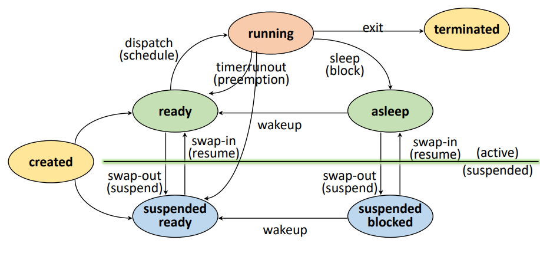

# [OS] 프로세스란

[toc]

## 프로세스란?

**프로그램은 컴퓨터에서 실행될 때 특정 작업을 수행하는 일련의 명령어들의 집합**이다. 어렵게 생각하지 말고, 우리가 평범하게 생각하고 말하는 프로그램이 이 프로그램이다. 롤, 오버워치와 같은 게임, .exe파일, 카카오톡 등 

**프로세스는 메모리에 올라와 CPU를 할당받고 실행되고 있는 프로그램**이다. 종종 스케줄링의 대상이 되는 작업(task)이라는 용어와 거의 같은 의미로 쓰인다. 프로세서와 이름이 비슷한데 프로세서는 컴퓨터 시스템을 통제하는 역할을 하는 하드웨어로, CPU다. 

 

## PCB (Process Control Block)

프로세스 제어 블록(Process Control Block, PCB)은 **프로세스의 중요한 정보를 저장해두는** 운영체제 커널의 자료구조이다. 프로세스의  상태 관리와 문맥교환을 위해 필요하며 프로세스 생성 시에 만들어지며 주기억장치에 유지된다.

운영체제에 따라 PCB에 포함되는 항목이 다를 수 있지만, 일반적으로 다음과 같은 정보가 포함된다.

- 프로세스 식별자(Process ID) : 프로세스 고유 식별 번호
- 프로세스 상태(Process State): 생성(create), 준비(ready), 실행(running), 대기(waiting), 완료(terminated) 상태이다. 유예준비상태suspended ready, 유예대기상태suspended wait는 스택이 아닌 disk에 저장된다.
- 프로그램 계수기(Program Counter): 프로그램 계수기는 이 프로세스가 다음에 실행할 명령어의 주소를 가리킨다.
- CPU 레지스터 및 일반 레지스터
- CPU 스케줄링 정보: 우선 순위, 최종 실행시각, CPU 점유시간 등
- 메모리 관리 정보: 해당 프로세스의 주소 공간 등
- 프로세스 계정 정보: 페이지 테이블, 스케줄링 큐 포인터, 소유자, 부모 등
- 입출력 상태 정보: 프로세스에 할당된 입출력장치 목록, 열린 파일 목록 등

 

## 프로세스의 상태 전이

1. Created State 
   - 작업을 커널에 등록 & PCB 할당 및 프로세스 생성
   - **가용 메모리 공간 체크**해서 공간이 있으면 ready, 없으면 suspended ready로 프로세스 상태 전이
2. Ready State

   - **프로세서 외에** 다른 모든 자원을 할당받은 상태 (CPU를 기다리고 있는 상태)
   - Dispatch : CPU를 할당받고 running 상태로 전이하는 것

3. Running State

   - 프로세서와 필요한 자원을 **모두 할당**받은 상태
   - Preemption : 프로세서를 뺏기고 ready state로 돌아가는 것
   - Block/sleep : 필요한 자원을 보충하기 위해 asleep state로 전이하는 것. I/O등 자원 할당 요청 및 대기

4. Blocked/Asleep State

   - 프로세서 외에 **다른 자원**을 기다리는 상태 (자원 할당은 System call에 의해 이루어 짐)
   - Wake-up : I/O가 끝났다면 바로 running 상태로 가는 게 아니라, **ready 상태로 이동한다.**

5. Suspended State

   - 메모리를 할당 받지 못한(빼앗긴) 상태
   - Memory image를 swap device(프로그램 정보 저장을 위한 특별 파일 시스템)에 보관
   - Swap-out (suspended) : 메모리를 빼앗겨서 메모리 이미지를 사진찍어 저장하는 것
   - Swap-in (resume) : 메모리를 할당받아서 메모리 이미지로 메모리 복구하는 것

6. Terminated/Zombie State

   - 프로세스 수행이 끝난 상태. 모든 자원 반납 후, 커널 내에 **일부 PCB 정보만** 남아있는 상태
   - 다음에 비슷한 작업이 들어왔을 때 프로세스 관리를 효율적으로 하기 위해 정보를 수집함

 

 

## 프로세스의 메모리 구조

프로세스는 Code, Data, Stack, Heap 영역을 갖는다.

- Code : 실행할 프로그램의 코드를 저장한다.
- Data : 프로그램이 사용하는 각종 데이터, 그 중에서도 전역/정적 변수가 저장된다.
  - Data에는 초기화된 전역 변수가 저장된다.
  - BSS에는 초기화되지 않은 전역 변수가 저장된다.
- Stack : 지역/매개 변수, 리턴 값 같이 잠시 사용되었다가 사라지는 데이터가 저장된다.
- Heap : malloc() 등 프로그래머가 동적으로 메모리를 할당하는 영역이다.

Stack 영역과 Heap 영역은 같은 공간을 공유한다. Stack은 높은 메모리 쪽에서 낮은 메모리 쪽으로, Heap은 낮은 메모리 쪽에서 높은 메모리 쪽으로 할당한다. 그래서 각 영역이 상대 공간을 침범하는 것을 Stack Overflow, Heap Overflow라고 한다.

각각의 프로세스는 서로의 메모리 영역을 공유하지 않는다. 하지만 하나의 프로세스 안에서 생성된 스레드들은  Stack을 제외하고 Code, Data, Heap 영역을 공유한다.

 

## IPC (Inter-Process Communication)

프로세스 간 통신(Inter-Process Communication, IPC)이란 **프로세스들 사이에 서로 데이터를 주고받는 행위** 또는 그에 대한 방법이나 경로를 뜻한다. 병행 프로세스는 독립 프로세스와 협력 프로세스로 나뉘는데, 협력 프로세스는 다른 프로세스와 영향을 주고 받으며 그 과정에서 IPC를 사용한다. 다음과 같은 이점이 있다.

- 정보공유 : 동일한 정보에 대해 공유 접근
- 계산 가속화 : 특정 작업을 분할 실행하여 빠르게 처리
- 모듈성 :  별도의 프로세스, 스레드로 구분해 모듈식 형태로 구성
- 편의성 : 동시에 다수의 작업 수행

IPC의 종류

1. Anonymous PIPE
2. Named PIPE (FIFO)
3. Message Queue
4. Shared Memory
5. Memory Map
6. Socket
7. Semaphore

 

## 멀티 프로세싱과 멀티 태스킹

멀티 프로세싱은 다수의 프로세서가 협력적으로 다수의 작업을 처리하는 것을 의미한다. 주의해야 할 점은 프로세스가 아니라 프로세서라는 점이다. 대칭형 멀티 프로세싱 (SMP)와 비대칭형 멀티 프로세싱 (AMP)로 나뉠 수 있다.

멀티 프로세싱의 경우 하나의 프로세서가 고장나더라도 작업이 정지되지 않는다. 또, 주변장치, 대용량 저장장치 등을 공유하고 있기 때문에 여러 프로그램이 동일한 데이터를 사용한다면 비용을 절약할 수도 있다.

멀티 태스킹은 하나의 프로세서 상에서 다수의 작업을 운영체제의 스케줄링에 의해 번갈아가며 처리하는 것을 의미한다. 스케줄링 방식은 멀티 프로그래밍 방식(Multi-programming), 시분할 방식(Time-sharing), 실시간 시스템 방식(Real-time)이 있다. 멀티 태스킹은 비선점형 멀티태스킹, 선점형 멀티태스킹으로 나뉠 수 있다.

 

# 참고

- [운영체제 강의](https://www.youtube.com/playlist?list=PLBrGAFAIyf5rby7QylRc6JxU5lzQ9c4tN)
- [멀티태스킹이란?](https://donghoson.tistory.com/16)
- [프로세스-위키백과](https://ko.wikipedia.org/wiki/%ED%94%84%EB%A1%9C%EC%84%B8%EC%8A%A4)
