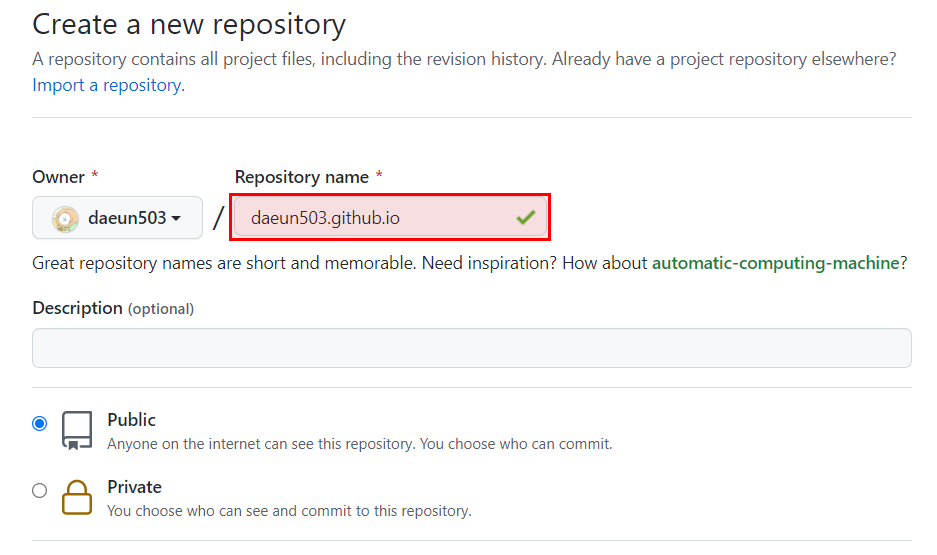
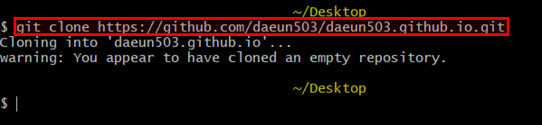
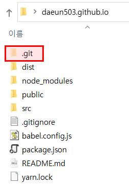
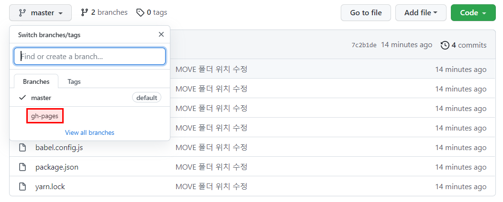
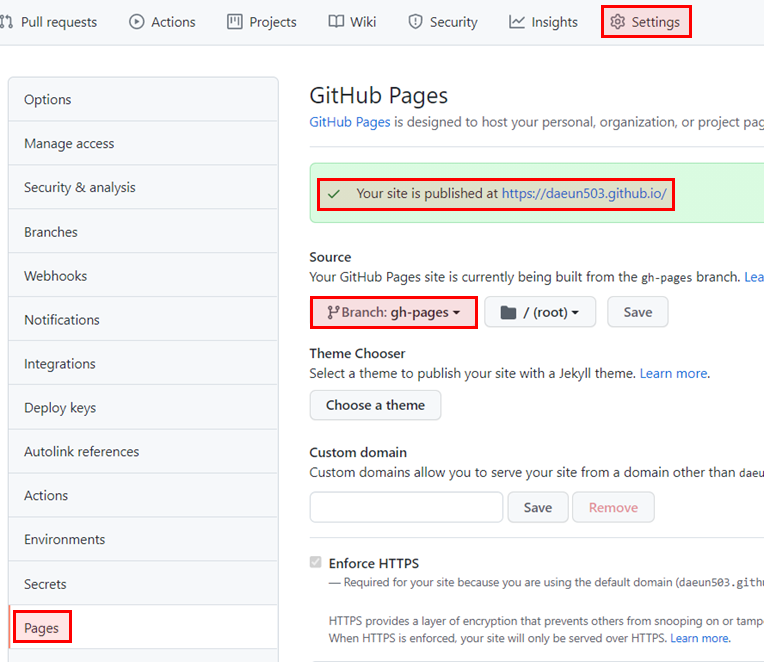
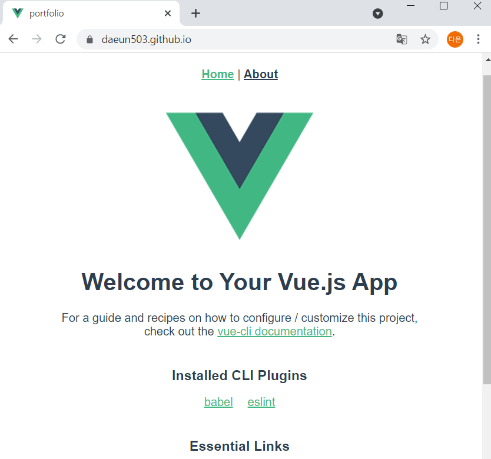

# [Vue.js] Github Pages 로 배포하기

다른 사람들의 Github 를 돌아다니다보면 종종 Github.io 페이지를 만난다. 다들 보통 블로그로 사용하는 것 같은데, 난 티스토리가 있으니 포트폴리오 사이트로 만들어보려고 한다. 다들 지킬 테마를 많이 쓰는 것 같은데 둘러보니 내 맘에 드는 테마가 없어서.. 직접 만들어보려고 한다. 테마를 구경할 사람은 아래 링크로, 만드는 방법은 검색하면 많이 나온다.

- Jekyll Themas http://jekyllthemes.org/


본론으로 들어가 [Vue.js] Github Pages로 배포하기를 진행하자.

1. repository 만들기

   - github에 접속하여 < username >.github.io 라는 이름으로 새로운 repository를 생성하자.

   

   

2. Vue 프로젝트 생성 & git 저장소 연결

   ```shell
   # 프로젝트 생성 후 폴더 안으로 이동 (ex. vue create portfolio)
   $ vue create 프로젝트명
   $ cd 프로젝트명
   
   # router 추가 이후 두개 항목 y 입력 (1. Still proceed? & 2. User history mode for router)
   $ vue add router
   
   # 실행 확인 npm run serve 를 해도 되지만, 포스팅에선 yarn을 사용할 예정
   # 잘 되는 것 확인했으면 ctrl + c 해서 종료하기
   $ yarn serve 
   ```

   - "vue create 프로젝트명" 명령어를 입력하면 프로젝트명 폴더가 생기고, 그 안에 파일들이 생기는데 폴더 안 파일과 .git 이 같은 위치에 있어야한다! (플젝 폴더랑 .git파일을 같은 위치에 두고 안 돼서 당황했다.. 아래와 같은 구조로 만들면 된다. vue 파일 생성한 후 dist폴더는 없는 게 정상!)

   

3. GitHub Pages 로 배포하기 위한 라이브러리 추가하기

   ```shell
   $ yarn add gh-pages -D
   ```

   ```json
   // package.json
   {
     "name": "portfolio",
     "version": "0.1.0",
     "private": true,
     // homepage 링크 추가
     "homepage": "https://daeun503.github.io/",
     // scripts의 predeploy, deploy, clean 추가
     "scripts": {
       "serve": "vue-cli-service serve",
       "build": "vue-cli-service build",
       "predeploy": "vue-cli-service build",
       "deploy": "gh-pages -d dist",
       "clean": "gh-pages-clean",
       "lint": "vue-cli-service lint"
     },
     ...
   }
   ```

   - homepage : 본인의 웹 사이트 주소
   - predeploy : deploy가 실행되기 전에 먼저 실행된다. 즉, vue-cli-service build가 실행된다.
   - deploy : deploy (gh-pages -d dist) 를 실행한다. yarn deploy 를 실행하면 gh-pages라는 브랜치를 생성해서 푸쉬한다.
   - clean : gh-pages-clean 가 실행. gh-pages라는 브랜치가 이미 있다는 에러가 발생할 때 실행하면 된다.

4. yarn deploy 실행 후 확인

   ```shell
   # dist 폴더가 생성 & 저장소에 gh-pages라는 브랜치가 생성되는 것을 확인할 수 있다.
   $ yarn deploy
   ```

   

5. 저장소 setting 후, 배포 페이지가 잘 뜨면 완료 

   - settings - Pages - Branch가 master로 되어있다면 gh-pages로 변경 - site확인하기
   - 우리가 gh-pages 라이브러리를 통해 빌드/배포한 파일이 gh-pages 브랜치에 들어가있다.

   

   


이제 자신만의 홈페이지를 만들면 된다. 수정한 후 yarn deploy를 실행하면 자동 반영된다.

