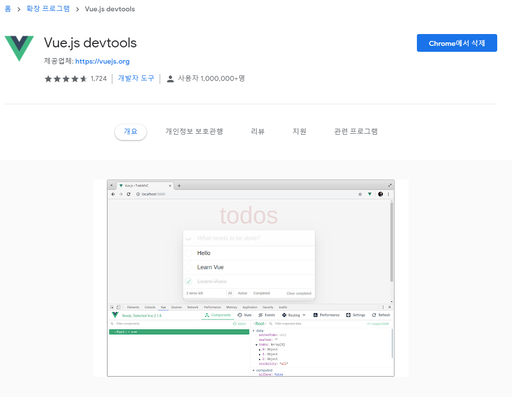
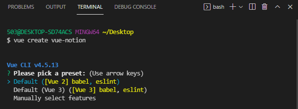
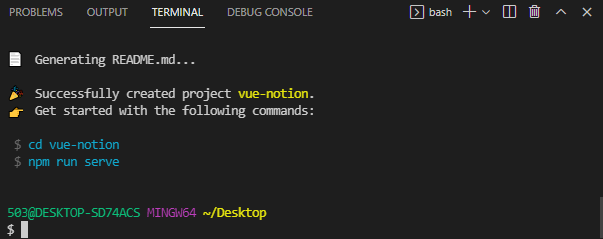
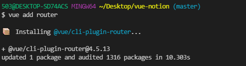
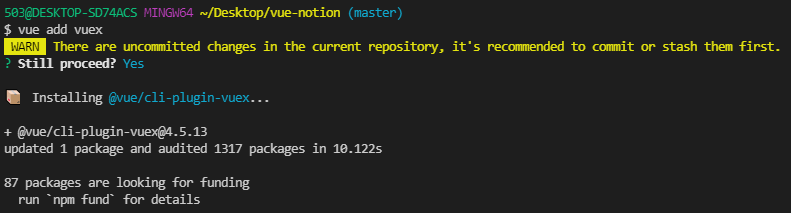
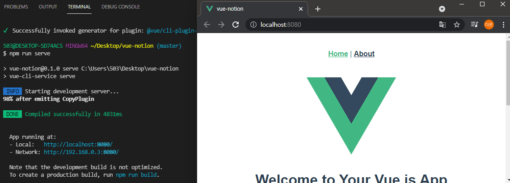

# [Vue.js] 프로젝트 생성하기


Vue 프로젝트를 생성해보자. 오랜만에 만들려고 하면 기억이 잘 안 나서 정리본을 만들어두려고 써본다.

```bash
# 요약: vue 플젝 & 라우터 & vuex 추가
$ vue create 프로젝트명
$ cd 프로젝트명
$ vue add router
$ vue add vuex
$ npm run serve
```


<br/>

### 처음 시작한다면

1. Node.js 설치 https://nodejs.org/ko/

2. Vue & Vue CLI 설치 

   - https://kr.vuejs.org/v2/guide/installation.html#NPM
   - https://kr.vuejs.org/v2/guide/installation.html#CLI

   ```bash
   # vue 설치
   $ npm install vue
   
   # Vue CLI 설치
   $ npm install -g @vue/cli
   
   # 버전 확인
   $ vue --version
   
   # 프로젝트 생성 => 하단에 설명
   $ vue create 프로젝트명
   ```

3. Vue Devtools (선택) https://kr.vuejs.org/v2/guide/installation.html#Vue-Devtools

   크롬 확장 프로그램에서 설치할 수 있다.

   


<br/>

### 만들어본 적 있다면

1. Vue 프로젝트 생성

   ```bash
   # Vue 프로젝트 생성 & 버전 선택 => Vue2
   # 버전을 선택할 때 CLI창에서는 선택 화살표가 위아래로 안 움직이니까 VScode같은 IDE에서 쓰자
   $ vue create 프로젝트명
   
   # 프로젝트 폴더 안으로 이동 
   $ cd 프로젝트명
   
   # 프로젝트 실행하면 화면을 볼 수 있다.
   $ npm run serve
   ```

   

   

2. Vue router 추가 (선택) https://cli.vuejs.org/migrating-from-v3/#the-global-vue-cli

   ```shell
   # 생성한 vue 프로젝트 폴더 안에서 실행 ("cd 프로젝트명"으로 이동하면 됨)
   $ vue add router
   
   # 이후 다음 두 개에 대한 질문이 출력되는데 둘 다 yes를 해준다.
   # 1. 이전 내역을 commit 할 것인지(처음 생성한 플젝이면 안 뜸) => y
   # 2. 히스토리 모드를 사용할 것인지 => y
   ```

   

3. Vuex 추가 (선택) https://cli.vuejs.org/migrating-from-v3/#the-global-vue-cli

   ```shell
   # router와 동일하게 생성한 vue 프로젝트 폴더 안에서 실행
   $ vue add vuex
   
   # 이후 다음 한 개에 대한 질문이 출력되는데 yes를 해준다.
   # 1. 현재 repo에 commit 되지 않은 변경 사항이 있는데 진행할 것 인지 => y 
   ```

   

4. 실행 및 확인

   ```bash
   # 생성한 vue 프로젝트 폴더 안에서 실행
   $ npm run serve
   # 로컬호스트에 접속하면 화면을 확인할 수 있다.
   ```

   

