# [MongoDB] 설치하기

## 설치하기

1. https://www.mongodb.com/try/download/community
   - 내용은 알아서 채워져 있을 것. Download를 클릭한다.

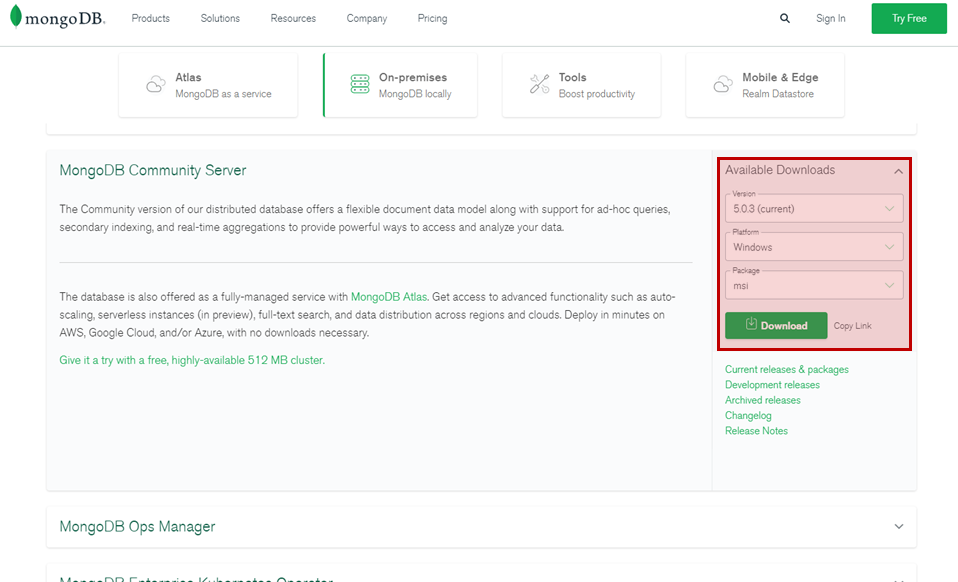

2. 설치파일 실행

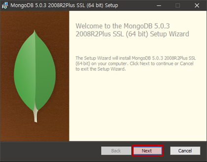

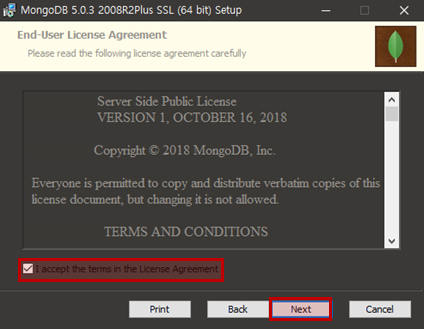

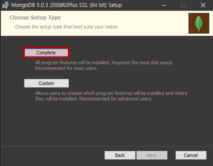

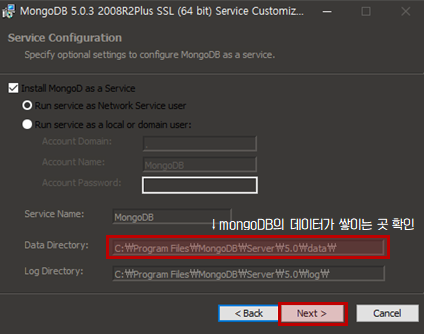

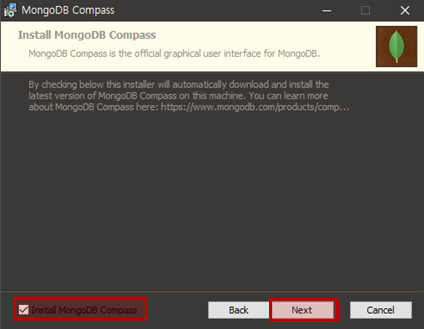

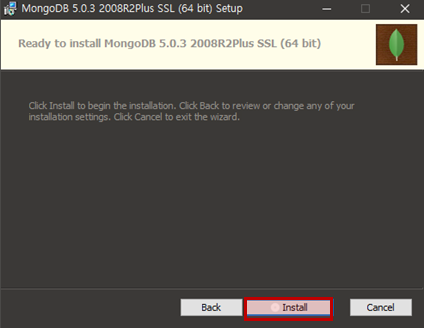

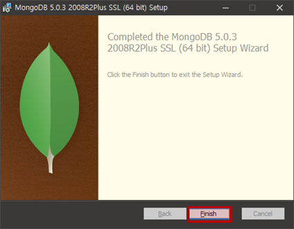

3. 환경 변수 설정
   - 시스템 변수 Path에 C:\Program Files\MongoDB\Server\5.0\bin 추가
   - 경로는 설치할 때 바꿨으면 다를 수도 있음

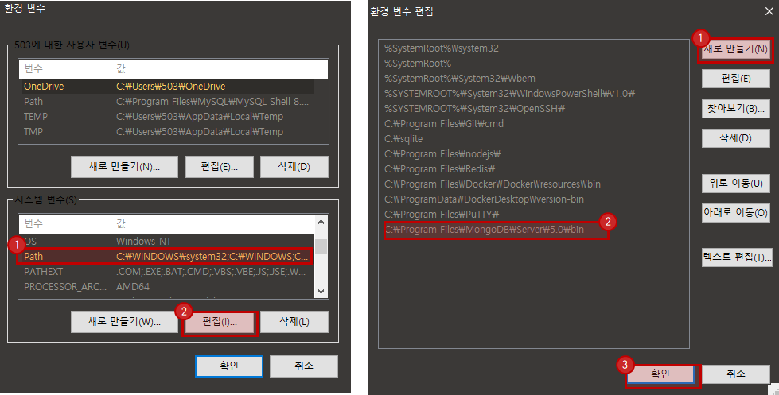

3. 설치 확인
   - cmd에 mongo --version

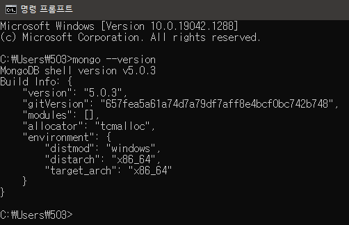

4. data/db 폴더 생성

   - C: 에 data폴더, data폴더 안에 db 폴더 생성

   - mongod는 mongoDB 데몬의 약자로 mongoDB server를 활성화시킨다. 자동으로 data/db폴더를 찾고 안에 데이터를 쌓는다.

     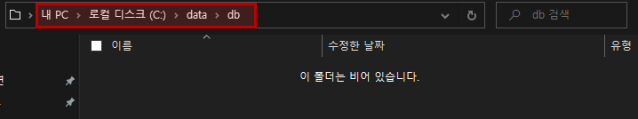

   - cmd창에서 mongod 실행 => 27017 (default) port 연결 대기

     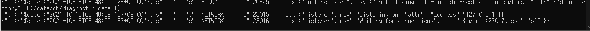

5. 잘 설치 됐으면, cmd에 mongo입력(Client 신분으로 mongoDB에 접속)하면 shell로 넘어간다.

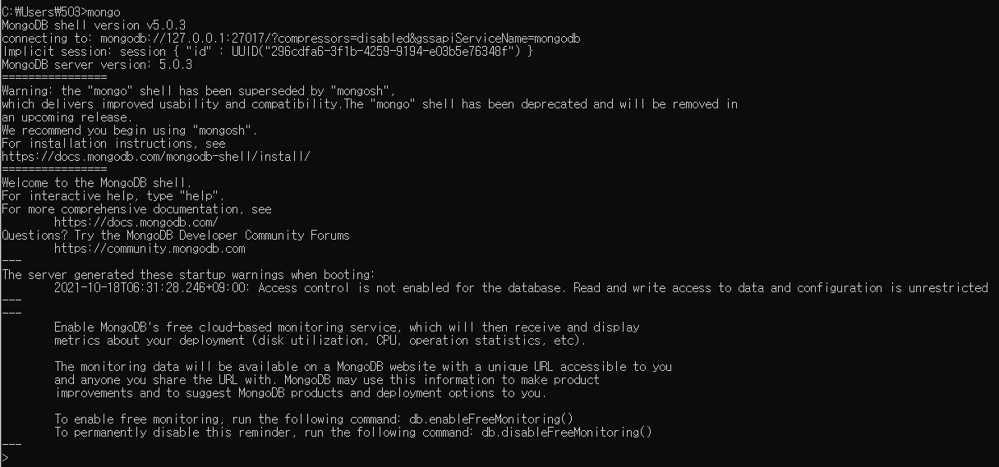

6. mongoDB compass 확인
   - mongodb://localhost:27017/mydbname 입력 후 connect

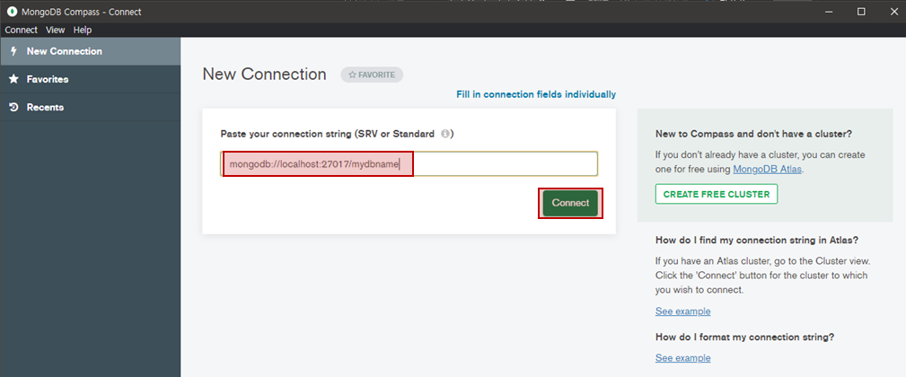

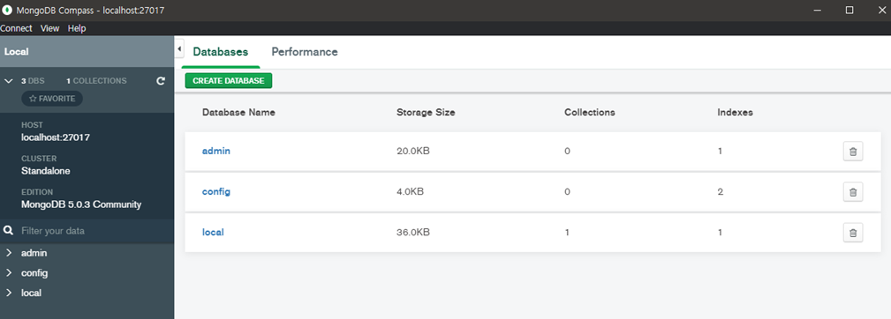

 

## 링크

1. MongoDB Install 및 실행 https://velog.io/@ruddms936/%EC%84%A4%EC%B9%98