# MySQL

## 1. 설치하기

1. [MySQL 홈페이지](https://downloads.mysql.com/archives/installer/)에 접속하여 다운로드 합니다.

   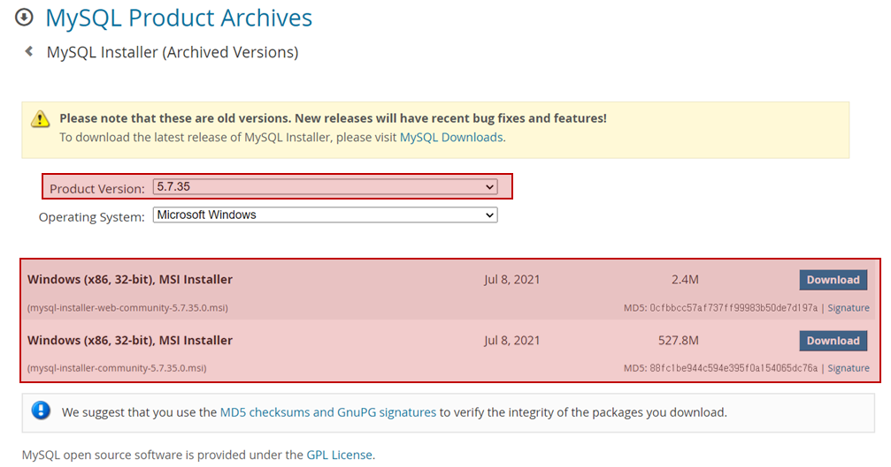

2. 개발자 모드로 설치를 진행합니다.

   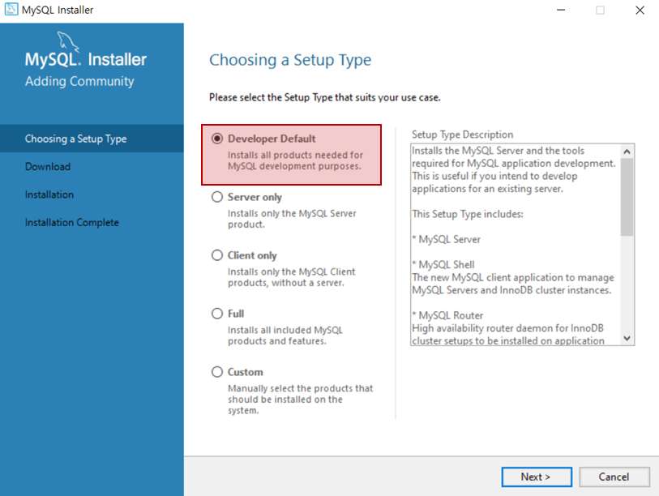

3. 필요한 설치 요소들을 설치합니다. 그 후 next 버튼을 누릅니다.

   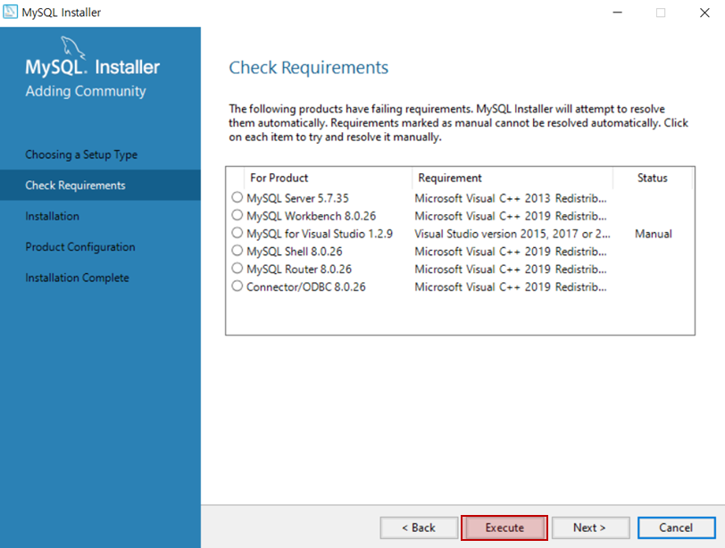

4. 다음 설치 요소 또한 설치한 후, next 버튼을 누릅니다.

   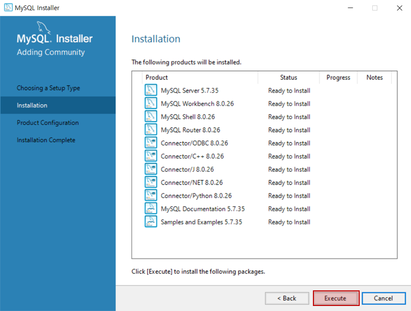

5. next 버튼을 누릅니다.

   

6. 포트 번호가 3306인 것을 기억하고 next 버튼을 누릅니다.

   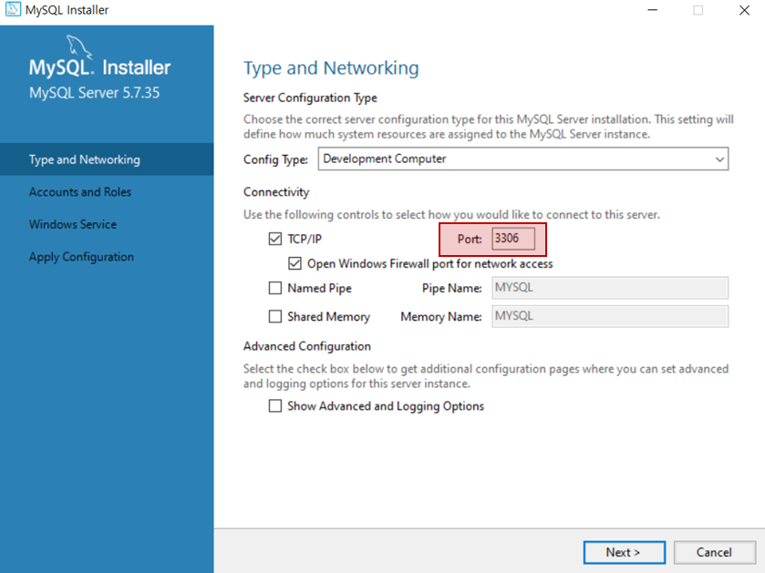

7. 비밀번호 작성 후, next 버튼을 누릅니다.

   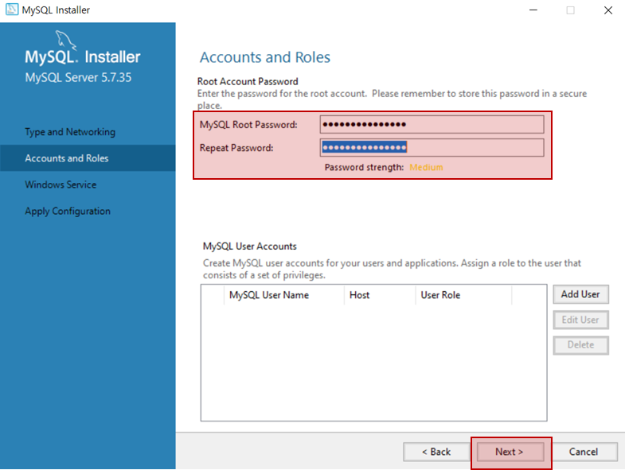

8. next 버튼을 누릅니다.

   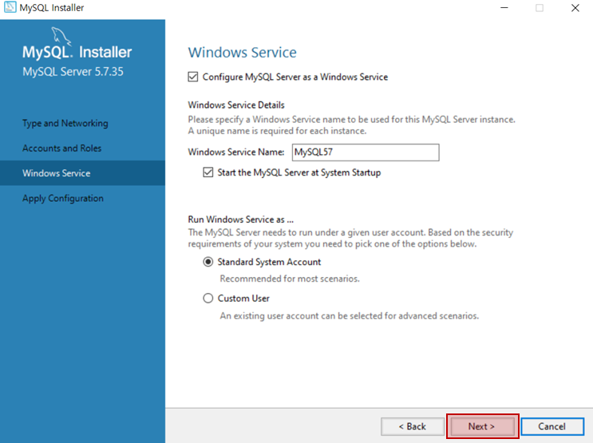

9. execute 버튼을 누릅니다.

   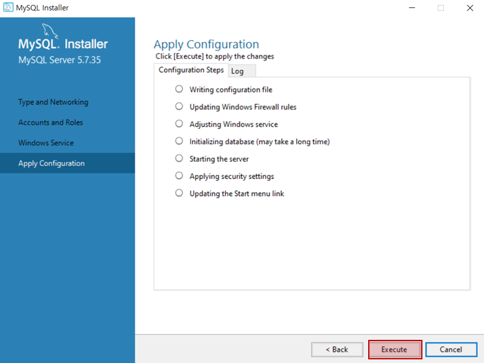

10. finish 버튼을 누릅니다.

    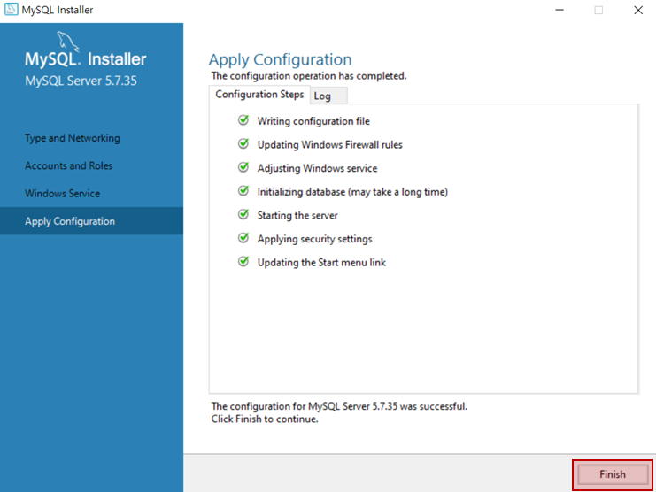

11. next 버튼을 누릅니다.

    

12. finish 버튼을 누릅니다.

    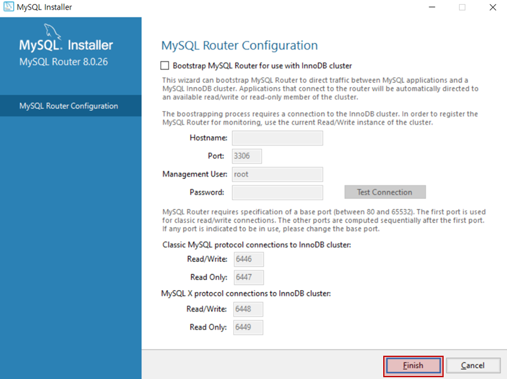

13. next 버튼을 누릅니다.

    

14. 앞서 설정했던 비밀번호를 입력한 후, check를 누릅니다. 초록색 체크 표시가 뜨면 next를 누릅니다.

    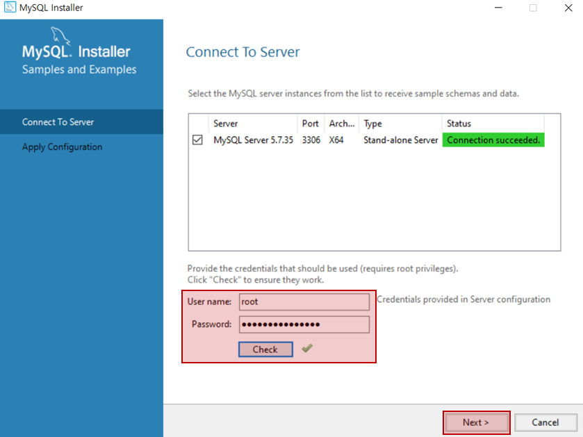

15. execute 버튼을 누릅니다.

    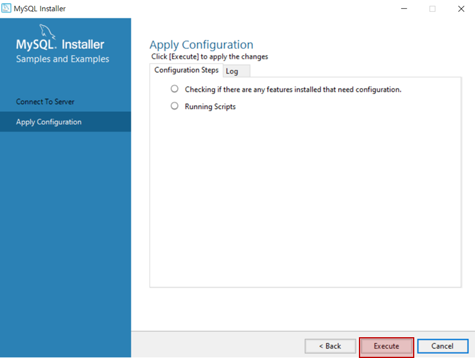

16. finish 버튼을 누릅니다.

    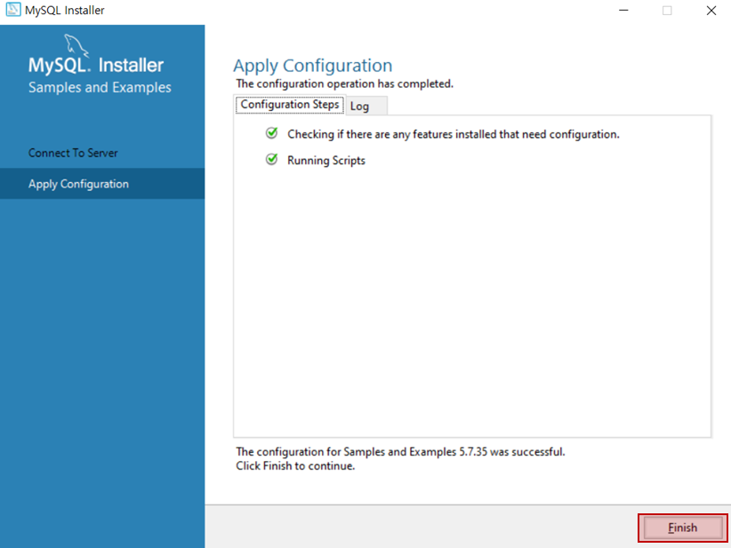

17. next 버튼을 누릅니다.

    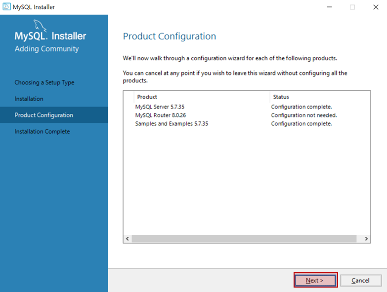

18. finish 버튼을 누릅니다.

    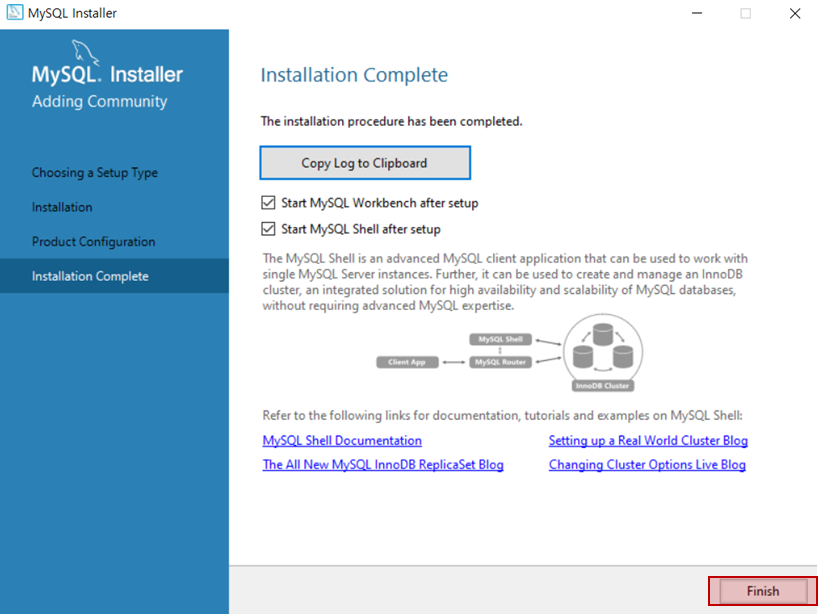

19. workbench의 경우, MySQL connections에 있는 탭을 누르면 연결 창이 뜹니다. 기존에 설정했던 비밀번호를 입력하면 접속이 가능합니다.

    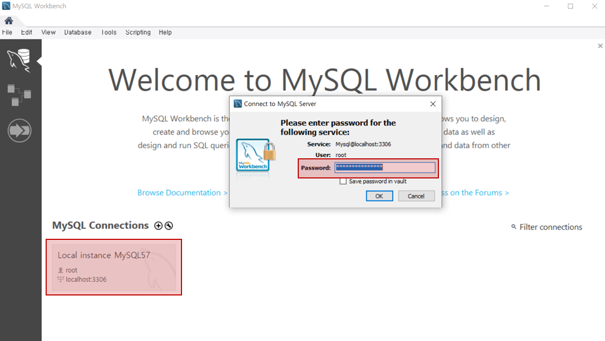
    
20. cmd에서 MySQL을 사용하기 위해서는 환경 변수를 추가해야 합니다. 환경 변수 탭으로 접근하여 시스템 변수의 Path에 환경 변수를 추가하도록 합니다. 

    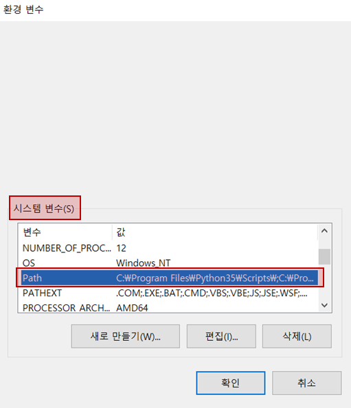

21. 새로 만들기를 통해 새로운 환경 변수를 추가해줍니다. 경로를 따로 수정하지 않았다면 C:\Program Files\MySQL에 있습니다. 해당 폴더 안에 bin 파일, 즉 C:\Program Files\MySQL\MySQL Server (버전)\bin 을 Path에 추가해줍니다.

    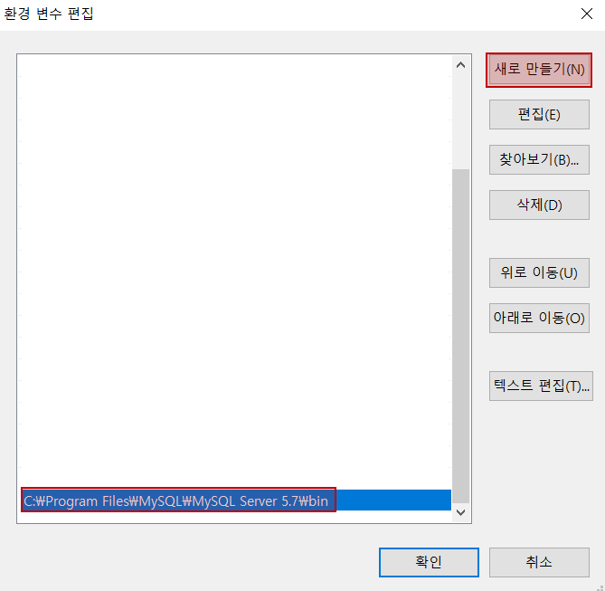

 

# 참고 자료

- [MySQL 다운로드 및 설치 방법](https://velog.io/@joajoa/MySQL-%EB%8B%A4%EC%9A%B4%EB%A1%9C%EB%93%9C-%EB%B0%8F-%EC%84%A4%EC%B9%98-%EB%B0%A9%EB%B2%95)
- [[mysql] MySQL 환경 변수 설정 방법 (윈도우 10 기준)](https://hoho325.tistory.com/163)
