# MongoDB

## 설치하기

1. https://www.mongodb.com/try/download/community
   - 내용은 알아서 채워져 있을 것. Download를 클릭한다.

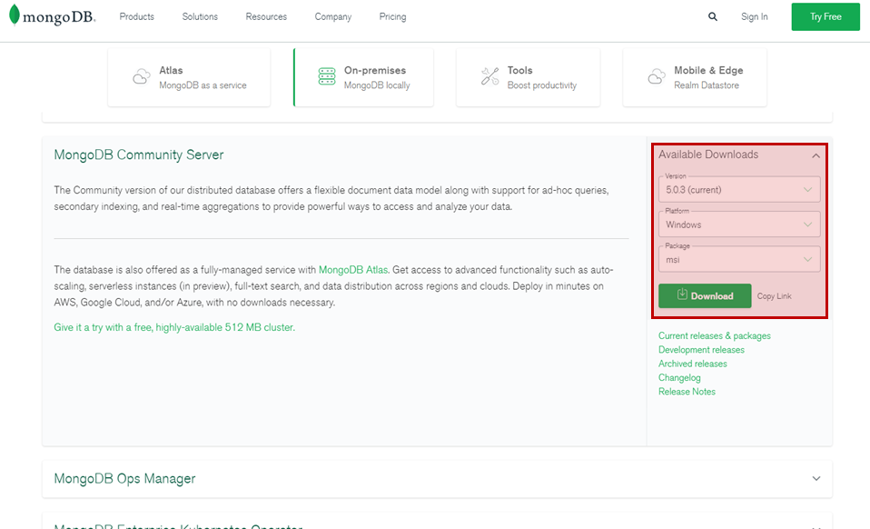

2. 설치파일 실행

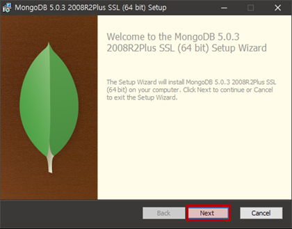

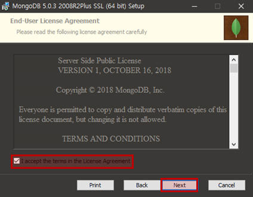

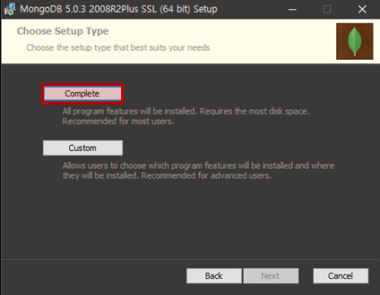

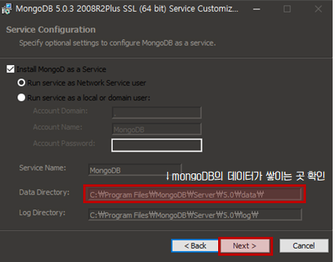

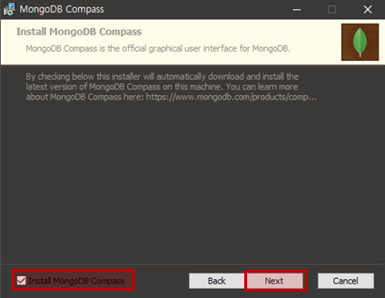

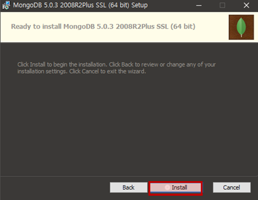

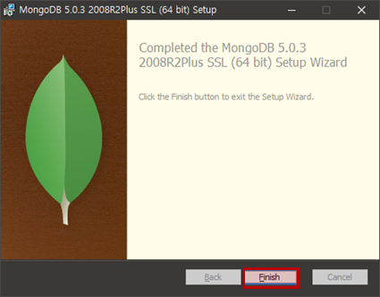

3. 환경 변수 설정
   - 시스템 변수 Path에 C:\Program Files\MongoDB\Server\5.0\bin 추가
   - 경로는 설치할 때 바꿨으면 다를 수도 있음

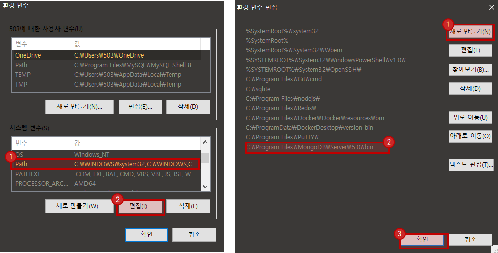

3. 설치 확인
   - cmd에 mongo --version

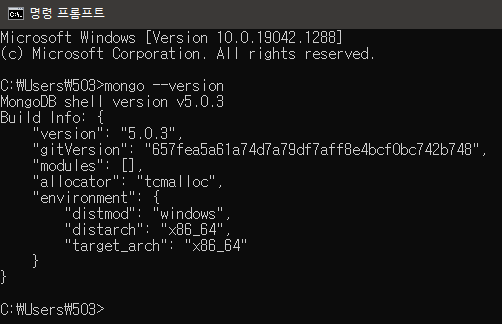

4. data/db 폴더 생성

   - C: 에 data폴더, data폴더 안에 db 폴더 생성

   - mongod는 mongoDB 데몬의 약자로 mongoDB server를 활성화시킨다. 자동으로 data/db폴더를 찾고 안에 데이터를 쌓는다.

     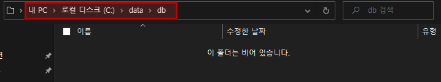

   - cmd창에서 mongod 실행 => 27017 (default) port 연결 대기

     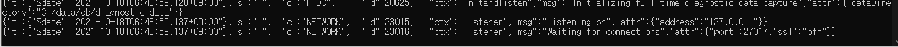

5. 잘 설치 됐으면, cmd에 mongo입력(Client 신분으로 mongoDB에 접속)하면 shell로 넘어간다.

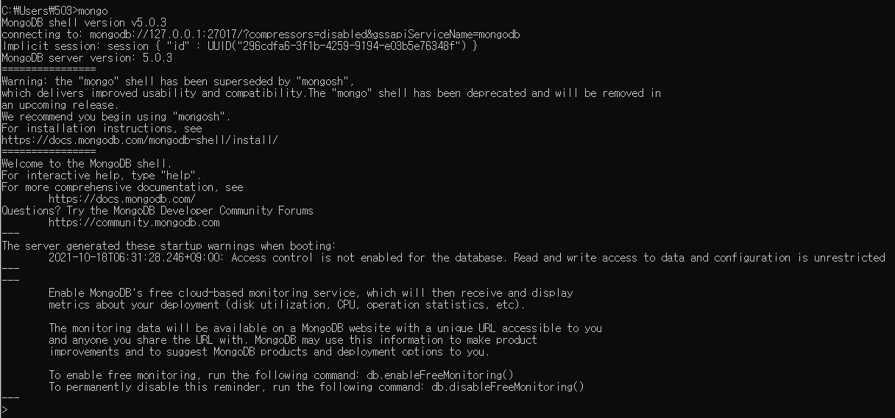

6. mongoDB compass 확인
   - mongodb://localhost:27017/mydbname 입력 후 connect

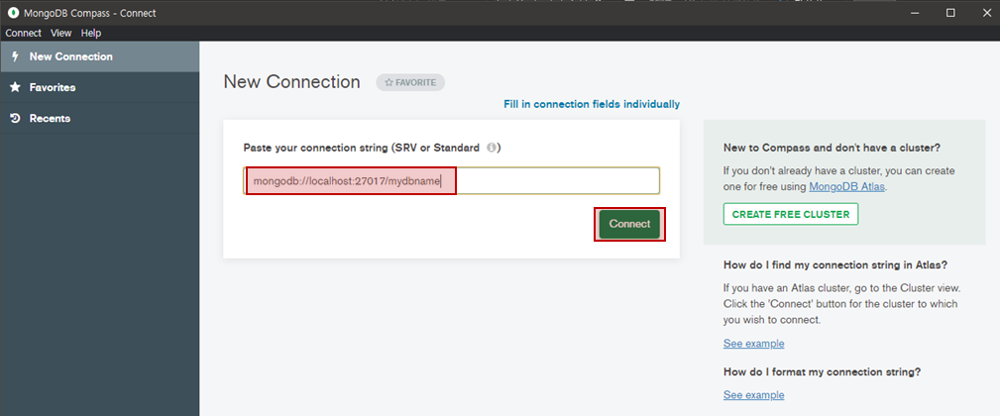

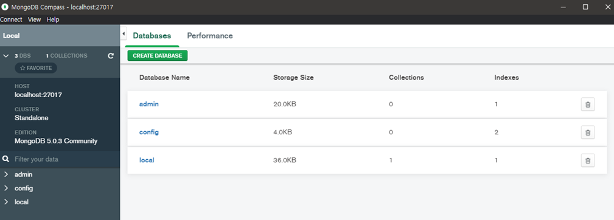

<br/>

## 스키마

### 1. 1:1

1. Embeding

   ```json
   {
     name: "Peter Wilkinson",
     age: 27,
     address: {
       street: "100 some road",
       city: "Nevermore"
     }
   }
   ```

   - 장점은, user 정보를 읽고 address 정보를 한 번에 같이 읽을 수 있다는 점

2. Linking

   ```json
   {
     _id: 1,
     name: "Peter Wilkinson",
     age: 27
   }
   
   {
     user_id: 1,
     street: "100 some road",
     city: "Nevermore"
   }
   ```

   - 전통적인 SQL 방식. mongoDB는 foreign key를 지원하지 않으므로 관계는 그저 application level schema 의 일부로만 존재함 


### 2. 1:N

1. Embeding

   ```json
   {
     title: "An awesome blog",
     url: "http://awesomeblog.com",
     text: "This is an awesome blog we have just started",
     comments: [{
       name: "Peter Critic",
       created_on: ISODate("2014-01-01T10:01:22Z"),
       comment: "Awesome blog post"
     }, {
       name: "John Page",
       created_on: ISODate("2014-01-01T11:01:22Z"),
       comment: "Not so awesome blog"
     }]
   }
   ```

   - 모든 comment를 post 검색할 때 알 수 있다. 추가도 comments 마지막에 추가하면 되니 간단하다. 하지만 세가지를 주의해야한다.
   - 첫 번째, comments가 최대 document size인 16MB를 넘을 수 있다.
   - 두 번째, 쓰기 성능에 관련이 있다. 시간이 지나 comment가 쌓일수록 mongoDB가 document의 padding을 예측하기 어려워진다. 또한 document를 새 메모리 위치에 복사하고 모든 인덱스를 업데이트해야한다. 이로 인해 더 많은 IO 로드가 발생할 수 있다. (쓰기 트래픽이 많을 때 중요. 소규모는 괜찮)
   - 세 번째, comment의 pagination을 수행할 때 문제가 있다. 일반적인 find를 이용하여 post를 검색할 때 comment의 수를 제한할 방법이 없다. 그래서 전체를 검색하고 애플리케이션에서 필터해야한다.

2. Linking

   ```json
   {
     _id: 1,
     title: "An awesome blog",
     url: "http://awesomeblog.com",
     text: "This is an awesome blog we have just started"
   }
   
   {
     blog_entry_id: 1,
     name: "Peter Critic",
     created_on: ISODate("2014-01-01T10:01:22Z"),
     comment: "Awesome blog post"
   }
   {
     blog_entry_id: 1,
     name: "John Page",
     created_on: ISODate("2014-01-01T11:01:22Z"),
     comment: "Not so awesome blog"
   }
   ```

   - 장점은 추가 comment로 인해 문서가 커지지 않아서 document의 최대 크기를 넘길 가능성이 적다는 것, comment의 pagination을 수행하기 더 쉽다는 것. 단점은 1000개의 comment가 있으면 1000개의 document를 다시 읽어야한다는 점.

3. Bucketing

   ```json
   {
     _id: 1,
     title: "An awesome blog",
     url: "http://awesomeblog.com",
     text: "This is an awesome blog we have just started"
   }
   
   {
     blog_entry_id: 1,
     page: 1,
     count: 50,
     comments: [{
       name: "Peter Critic",
       created_on: ISODate("2014-01-01T10:01:22Z"),
       comment: "Awesome blog post"
     }, ...]
   }
   {
     blog_entry_id: 1,
     page: 2,
     count: 1,
     comments: [{
       name: "John Page",
       created_on: ISODate("2014-01-01T11:01:22Z"),
       comment: "Not so awesome blog"
     }]
   }
   ```

   - 위의 두가지 방식을 혼합. comment를 50개씩 분할


### 3. N:M


## 링크

1. MongoDB Install 및 실행 https://velog.io/@ruddms936/%EC%84%A4%EC%B9%98
2. [MongoDB] 강좌 1편: 소개, 설치 및 데이터 모델링 https://velopert.com/436
3. Learn MongoDB The Hard Way http://learnmongodbthehardway.com/schema/schemabasics/